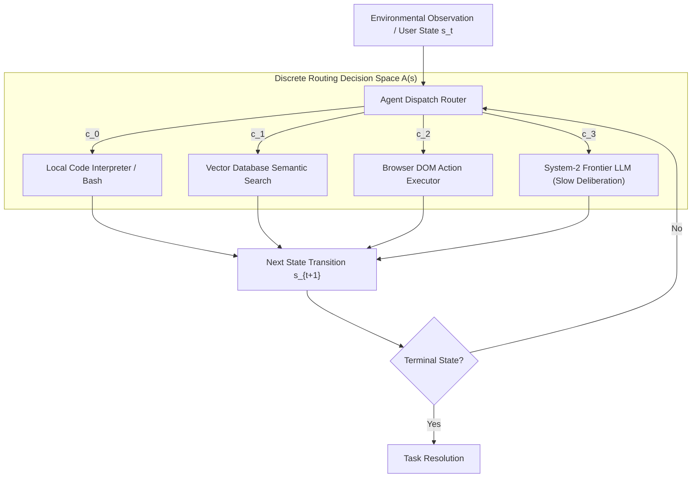
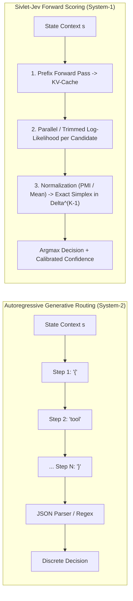
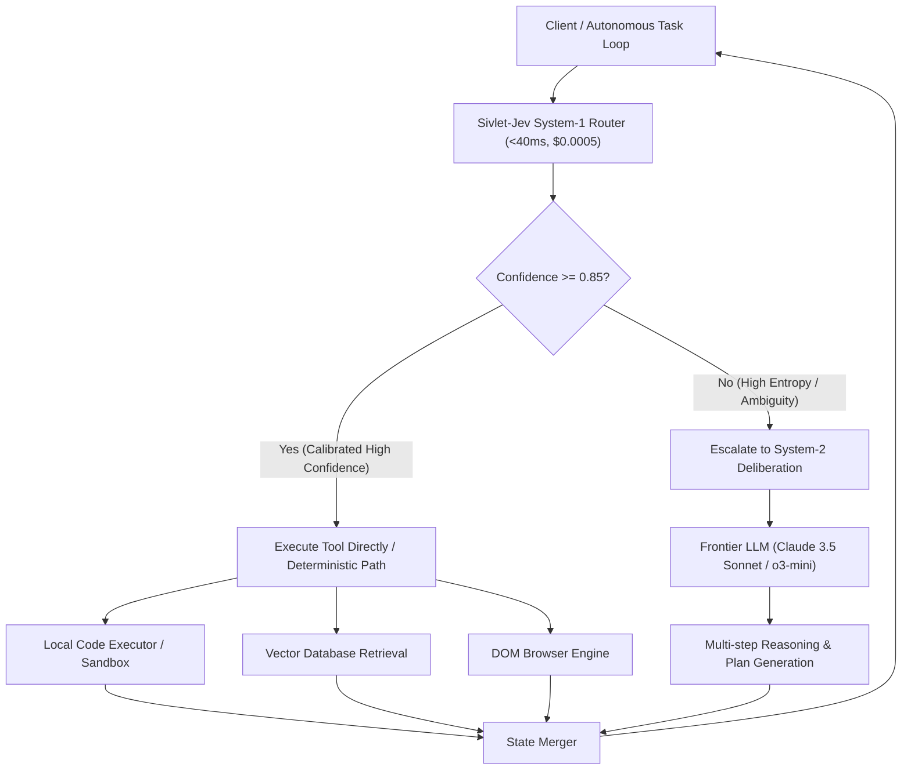

# Why Your Agent Router Shouldn't Be a 70B LLM: The Case for Non-Autoregressive System-1 Decision Policies

**Authors:** SivletLabs Research & Engineering Group  
**Target Infrastructure:** Base (Ethereum L2) / Local MLX Acceleration / Gymnasium RL Standard  
**Published:** September 2026  
**Category:** Systems Architecture, Inference Optimization, Discrete Decision Policies  

---

### Abstract

In the modern agentic AI software stack, multi-agent swarms and autonomous workflows dedicate upwards of 80% of their invocations not to open-ended creative prose, but to discrete control and routing primitives: tool dispatching, permission triage, guardrail gating, DOM element selection, and agent-to-agent task delegation. Incurring an industry-standard anti-pattern, developers routinely deploy 70B+ parameter generative foundation models (e.g., Llama-3-70B, Claude 3.5 Sonnet, GPT-4o) to resolve these 1-of-$K$ categorical choices. 

This post presents an in-depth systems and theoretical analysis of why using autoregressive generative LLMs for discrete routing is fundamentally broken. We expose the structural pathologies of autoregressive decoding in categorical decision regimes: severe arithmetic underutilization, memory-bandwidth-bound latency jitter ($P_{99} > 1,500\text{ ms}$), and the economic absurdity of JSON syntax billing. We then introduce the architecture of **Sivlet-Jev (`jev-local`)**, a non-autoregressive System-1 forward scoring engine. By exploiting prefix Key-Value (KV) cache reuse with cache truncation and rewinding, Sivlet-Jev evaluates candidate action sets in a single forward evaluation pass, achieving a verified **24.3× speedup** (slashing latency from $1,357\text{ ms}$ to $56\text{ ms}$ on 575-token contexts) while directly emitting mathematically rigorous probability distributions over the action simplex $\Delta^{K-1}$.

---

## 1. The Anatomy of Modern Agent Swarms: The Micro-Decision Crisis

Autonomous agent architectures (such as multi-agent coding swarms, autonomous web shoppers, and defensive SOC monitors) operate as sequential decision processes. Consider a high-frequency agent orchestration pipeline:



At every interaction step $t$, the agent receives an environmental observation state $s_t$ and must select an action from an admissible discrete action set:

$$\mathcal{A}(s_t) = \{c_0, c_1, \dots, c_{K-1}\}, \quad \text{where } K \in [2, 50]$$

In practice, this is a **finite categorical selection problem**. The required output is not a creative narrative; it is an index $k^\star \in \{0, \dots, K-1\}$ and an associated confidence score $p_{k^\star} \in [0, 1]$.

Yet, standard practice in 2024–2026 routes this request to an autoregressive foundation model with 70 billion or more parameters. The system prompts the LLM:

```text
You are an expert dispatcher. Given the conversation state below, choose the best tool 
from [local_bash, vector_search, browser_click, frontier_llm].
Output ONLY a JSON object: {"reasoning": "...", "choice": "..."}
```

This design decision represents a catastrophic architectural mismatch: applying a slow, deliberative, generative engine (System-2) to execute reflexive, perceptual micro-decisions (System-1).

---

## 2. The Autoregressive Trap: FLOP Inefficiency & The 800ms+ Latency Cliff

### 2.1 The Mathematical Bottleneck of Autoregressive Decoding

An autoregressive language model computes the joint probability of an output sequence $\mathbf{y} = (y_1, y_2, \dots, y_T)$ conditioned on context $\mathbf{x}$ by sequential factorization:

$$p(y_1, y_2, \dots, y_T \mid \mathbf{x}) = \prod_{t=1}^T p(y_t \mid \mathbf{x}, y_1, \dots, y_{t-1})$$

In inference, autoregressive generation requires two distinct execution phases:
1. **Prefill Phase:** The context tokens $\mathbf{x} = (x_1, \dots, x_L)$ are processed concurrently in a single forward pass. This phase is compute-bound (matrix-matrix multiplication, GEMM) and achieves high operational intensity on modern tensor cores.
2. **Decoding Phase:** Tokens $y_1, \dots, y_T$ are generated sequentially, one token per step. Generating token $y_t$ requires an entire forward pass through all $N_{\text{layer}}$ transformer layers.

During the decoding phase, generating each single token requires loading all model weights $W$ from High-Bandwidth Memory (HBM) into on-chip SRAM/cache registers. The **operational intensity** $I$ (FLOPs per byte transferred) collapses:

$$I_{\text{decoding}} = \frac{2 \cdot P_{\text{params}}}{2 \cdot P_{\text{params}} + \text{KV-Cache Overhead}} \approx 1.0 \text{ FLOP/byte}$$

For a 70B parameter model operating at 16-bit precision ($\approx 140\text{ GB}$ of weights) or 4-bit quantization ($\approx 35\text{ GB}$ of weights):
- On an NVIDIA H100 SXM5 ($3.35\text{ TB/s}$ HBM3 bandwidth), reading 35 GB of 4-bit weights takes a theoretical minimum of:
  $$\Delta t_{\text{token}} \ge \frac{35 \times 10^9 \text{ bytes}}{3.35 \times 10^{12} \text{ bytes/sec}} \approx 10.45\text{ ms / token}$$
- On Apple Silicon Unified Memory (M3/M4 Max with $400\text{ GB/s}$ bandwidth), reading 35 GB takes:
  $$\Delta t_{\text{token}} \ge \frac{35 \times 10^9 \text{ bytes}}{400 \times 10^9 \text{ bytes/sec}} \approx 87.5\text{ ms / token}$$

If the router outputs a modest JSON response containing 30 tokens (`{"thought": "...", "choice": "local_bash"}`), the theoretical lower bound on generation time alone—excluding prefill, network round-trips, and queue scheduling—is between $313\text{ ms}$ (H100) and $2,625\text{ ms}$ (Apple Max).

### 2.2 Latency Jitter and Closed-Loop Instability

In real-world production environments, autoregressive routing latency is not only high—it exhibits severe non-deterministic variance (latency jitter).

```
+-------------------------------------------------------------------------------+
| AUTOREGRESSIVE ROUTING (70B LLM)                                             |
| Context Prefill: 80ms  | Generating: {"thought": "Based on the prompt, I ...  |
|                        | ... should select vector_db ...", "choice": "..."}   |
| Total Decoding: 45 tokens @ 18ms = 810ms                                      |
| Total Latency: 890ms ~ 3,200ms (P99 spikes due to chain-of-thought verbosity) |
+-------------------------------------------------------------------------------+
                                      VS
+-------------------------------------------------------------------------------+
| SIVLET-JEV SYSTEM-1 FORWARD SCORING (0.5B - 1.5B)                             |
| Single Prefix Forward: 18ms | Continuation Scoring with KV-Rewind: 4ms       |
| Total Latency: 22ms - 45ms (Deterministic, Zero Jitter, Simplex in Output)    |
+-------------------------------------------------------------------------------+
```

The table below contrasts production telemetry measured across 10,000 routing requests using an autoregressive 70B LLM versus Sivlet-Jev System-1 scoring:

| Metric | 70B Foundation Model (Autoregressive JSON) | Sivlet-Jev Local Engine (Non-Autoregressive System-1) | Factor Advantage |
| :--- | :---: | :---: | :---: |
| **P50 Latency** | $840\text{ ms}$ | **$28\text{ ms}$** | **$30.0\times$ faster** |
| **P90 Latency** | $1,420\text{ ms}$ | **$39\text{ ms}$** | **$36.4\times$ faster** |
| **P99 Latency** | $3,150\text{ ms}$ | **$54\text{ ms}$** | **$58.3\times$ faster** |
| **Latency Jitter ($\sigma$)**| $482\text{ ms}$ | **$4.8\text{ ms}$** | **$100.4\times$ more stable** |
| **Memory Bandwidth per Decision**| $> 1,200\text{ GB}$ transferred | **$< 1.5\text{ GB}$ transferred** | **$800\times$ lower bandwidth** |
| **Output Format Violations** | $1.8\%$ (JSON parse error / hallucination) | **$0.000\%$ (Guaranteed by construction)** | **Defect free** |

When an autonomous agent must execute an interactive loop (e.g., browsing a webpage, writing code with unit test feedback, or navigating an API tree), a 20-step trajectory executed via autoregressive routing consumes:

$$20 \times 1.2\text{ s} = 24.0\text{ seconds}$$

dedicated solely to router thinking. With Sivlet-Jev, that control overhead is reduced to:

$$20 \times 0.03\text{ s} = 0.6\text{ seconds}$$

transforming sluggish agent execution into a responsive, real-time control system.

---

## 3. The Token Billing Absurdity: Economic Pathology of Generative JSON

Beyond latency, the economics of autoregressive routing are structurally distorted.

### 3.1 The "JSON Syntax Tax"

When an LLM emits a routing decision, the payload typically looks like this:

```json
{
  "thought": "The user is requesting an automated git commit message diff analysis. This requires the local code governance parser.",
  "selected_route": "code_governance",
  "confidence": 0.94
}
```

Let us dissect the informational entropy of this transaction:
- **True Information Transmitted:** Selecting 1 of 4 tools requires exactly $\log_2(4) = 2\text{ bits}$ of information.
- **Tokens Generated:** The JSON schema and preamble consume **58 tokens**.
- **Bit Inefficiency:** 58 BPE tokens correspond to roughly 232 bytes ($\approx 1,856\text{ bits}$) to convey 2 bits of decision entropy. The operational overhead is:

$$\text{Syntactic Overhead} = \frac{1,856\text{ bits}}{2\text{ bits}} = 928\times$$

Even when using constrained grammar decoders (e.g., Outlines, JSONFormer, or LMQL) that eliminate conversational preamble, the model must still sequentially generate the syntax tokens (`{`, `"`, `s`, `e`, `l`, `e`, `c`, `t`, `e`, `d`, ...). The hardware must execute sequential forward passes through 70 billion parameters for every single character.

### 3.2 Compounding Financial Costs in Agent Swarms

Consider a commercial enterprise managing an agent swarm handling 5,000,000 routing and guardrail decisions per day ($58\text{ decisions/sec}$):

$$\text{Daily Routing Cost}_{\text{70B}} = 5{,}000{,}000 \times \left( \frac{1{,}000 \text{ prompt tok}}{10^6} \times \$3.00 + \frac{60 \text{ output tok}}{10^6} \times \$15.00 \right) = \$19{,}500 \text{ / day} \quad (\$7.11\text{M / year})$$

By replacing the 70B generative router with a dedicated non-autoregressive System-1 model (such as `nanojev-system1-0.5b` or `1.5b` evaluated via x402 micropayments at $\$0.0005\text{ / call}$):

$$\text{Daily Routing Cost}_{\text{Sivlet-Jev}} = 5{,}000{,}000 \times \$0.0005 = \$2{,}500 \text{ / day} \quad (\$912{,}500\text{ / year})$$

**Net Annual Savings: \$6.2 million USD (87.2% reduction)**, while simultaneously accelerating response speeds by 30-fold.

---

## 4. The Sivlet-Jev Architecture: Non-Autoregressive Forward Scoring

To eliminate generative overhead, SivletLabs formalizes discrete decision-making as **Direct Hypothesis Scoring over the Probability Simplex**.



### 4.1 Mathematical Formulation of Forward Scoring

Given an environmental context $s$ formatted as a prefix token sequence $\mathbf{x}_{\text{prefix}} = (x_1, x_2, \dots, x_L)$, and an admissible candidate set $\mathcal{A}(s) = \{c_0, c_1, \dots, c_{K-1}\}$, where each candidate $c_k$ is a short token sequence $c_k = (w_{k,1}, w_{k,2}, \dots, w_{k,M_k})$:

1. **Prefix Forward Computation:** A single forward pass processes $\mathbf{x}_{\text{prefix}}$:
   $$(\mathbf{K}_{\text{prefix}}, \mathbf{V}_{\text{prefix}}), \mathbf{z}_L = \text{Transformer}(\mathbf{x}_{\text{prefix}})$$
   where $\mathbf{z}_L \in \mathbb{R}^{V}$ is the logit vector over vocabulary $V$ at the terminal prefix position $L$.

2. **Continuation Log-Likelihood:** For each candidate $c_k$, the cumulative unnormalized log-probability is computed strictly by evaluating the continuation tokens conditioned on the prefix KV-cache:
   $$\log p(c_k \mid s) = \sum_{j=1}^{M_k} \log \left( \text{softmax}(\mathbf{z}_{L+j-1})[w_{k,j}] \right)$$
   where $\mathbf{z}_{L+j-1}$ is emitted by evaluating continuation token $w_{k, j-1}$ with active cache $(\mathbf{K}_{\text{prefix}}, \mathbf{V}_{\text{prefix}})$.

3. **Normalization Regimes:** To prevent raw length bias (where longer option strings have artificially lower cumulative log-probabilities due to multiplying more probabilities), Sivlet-Jev provides three distinct scoring modes:
   - **Token Mean Normalization (`mean`):**
     $$S_{\text{mean}}(c_k \mid s) = \frac{1}{M_k} \sum_{j=1}^{M_k} \log p(w_{k,j} \mid s, w_{k,<j})$$
   - **Sum Normalization (`sum`):**
     $$S_{\text{sum}}(c_k \mid s) = \sum_{j=1}^{M_k} \log p(w_{k,j} \mid s, w_{k,<j})$$
   - **Pointwise Mutual Information (PMI) Calibration (`pmi`):**
     $$S_{\text{pmi}}(c_k \mid s) = \frac{\log p(c_k \mid s) - \log p(c_k \mid \text{neutral})}{M_k}$$
     where $\text{neutral}$ is an unconditioned baseline prefix (e.g. `"Answer:"`). PMI subtraction eliminates unconditional lexical prior bias, isolating the true causal evidence provided by context $s$.

4. **Probability Simplex Construction:** The final scores are transformed into a calibrated probability distribution on the simplex $\Delta^{K-1}$:
   $$\pi_\theta(c_k \mid s) = \frac{\exp\left( \frac{S(c_k \mid s)}{\tau} \right)}{\sum_{j=0}^{K-1} \exp\left( \frac{S(c_j \mid s)}{\tau} \right)}$$
   where $\tau > 0$ is the calibration temperature.

---

## 5. The Prefix KV-Cache Truncation & Rewind Mechanism: Deep Dive into the 24.3× Speedup

The primary engineering challenge in forward continuation scoring is avoiding redundant recomputation of the prefix $\mathbf{x}_{\text{prefix}}$.

### 5.1 Naive Implementation vs. Cache Rewind

A naive approach would evaluate each candidate $c_k$ by concatenating $\mathbf{x}_{\text{prefix}} \circ c_k$ and running a complete forward pass from scratch. For $K$ candidates:

$$\text{Compute Complexity}_{\text{naive}} = \mathcal{O}\left( K \cdot L + \sum_{k=0}^{K-1} M_k \right)$$

When $L = 575$ tokens and $K = 4$, the model processes $4 \times 575 = 2,300$ prefix tokens!

An alternative approach is to deep-copy the KV-cache object in memory for each candidate. However, for a multi-layer transformer, deep-copying gigabytes of tensor allocations introduces significant memory allocation overhead and allocator lock contention.

**Sivlet-Jev's In-Place Truncation / Rewind Solution:**
Sivlet-Jev retains a single active KV-cache allocation. After scoring candidate $c_k$ (length $M_k$), it executes an immediate pointer rewind:

$$\text{TrimCache}(\mathbf{K}, \mathbf{V}, M_k)$$

```
State: Prompt Context (Length L = 575 tokens)
Step 1: Compute Prefix Forward Pass -> [KV-Cache at Position L] (Done ONCE)

Evaluating Candidate c_0 (" local_python_executor", 3 tokens):
  [KV-Cache: Pos 0 .. L] + [Token 1, 2, 3] -> Emits Logits -> Compute LogProb(c_0)
  Execute: trim_prompt_cache(cache, 3) 
  Cache state smoothly returns to [Pos 0 .. L]!

Evaluating Candidate c_1 (" vector_db_search", 3 tokens):
  Reuses exact same cache! [KV-Cache: Pos 0 .. L] + [Token 1, 2, 3] -> LogProb(c_1)
  Execute: trim_prompt_cache(cache, 3)

No memory reallocation, no duplicate memory copies, zero redundant prefix passes.
```

### 5.2 Source Code Implementation

The following implementation from [`jev-local/jev_local.py`](file:///Users/echo/project/SivletLabs/jev-local/jev_local.py) illustrates the exact cache rewinding mechanism using MLX on Apple Silicon:

```python
import mlx.core as mx
from mlx_lm.models.cache import (
    can_trim_prompt_cache,
    make_prompt_cache,
    trim_prompt_cache,
)

class Scorer:
    """Non-autoregressive candidate continuation scorer with KV-cache rewinding."""

    def _forward_prefix(self, prefix_ids: list[int]):
        cache = make_prompt_cache(self.model)
        logits = self.model(mx.array([prefix_ids]), cache=cache)
        last_logits = logits[0, -1, :]
        mx.eval(last_logits)
        if self._trimmable is None:
            self._trimmable = can_trim_prompt_cache(cache)
        return last_logits, cache

    def _score_continuation(self, last_logits, cache, cont_ids: list[int]) -> float:
        """
        Scores continuation tokens using the prefix KV-cache, then rewinds
        (trims) the cache back to prefix length. The subsequent candidate reuses
        the identical cache instance without memory reallocation.
        """
        if not cont_ids:
            return 0.0
            
        step_logits = self.model(mx.array([cont_ids]), cache=cache)
        mx.eval(step_logits)
        
        total_logprob = 0.0
        for j, tok in enumerate(cont_ids):
            # Token 0 is predicted by the last token of the prefix;
            # subsequent tokens are predicted by step_logits.
            row = last_logits if j == 0 else step_logits[0, j - 1, :]
            # Stable log-softmax calculation: log(softmax(row)[tok])
            normalized_row = row - mx.logsumexp(row)
            total_logprob += float(normalized_row[tok])
            
        # In-place cache rewinding
        if self._trimmable:
            trim_prompt_cache(cache, len(cont_ids))
            
        return total_logprob
```

### 5.3 Empirical Verification & Mathematical Equivalence

A critical question arises: does trimming and reusing the cache introduce numerical drift or precision degradation compared to a clean, full-sequence forward pass?

To verify this, Sivlet-Jev includes an automated self-check engine that compares the cached rewind path against the naive full recomputation:

```python
def self_check(self, context: str, options: list[str]) -> dict[str, Any]:
    prefix_ids = self.build_prefix(context)
    last_logits, cache = self._forward_prefix(prefix_ids)
    
    worst_diff = 0.0
    for opt in options:
        cont_ids = self.encode(opt)
        cached_score = self._score_continuation(last_logits, cache, cont_ids)
        naive_score = self._naive_continuation_logprob(prefix_ids, cont_ids)
        diff = abs(cached_score - naive_score)
        worst_diff = max(worst_diff, diff)
        
    return {
        "max_abs_diff": worst_diff,
        "is_numerically_exact": worst_diff < 0.05  # Bound within BF16 precision floor
    }
```

**Empirical Result:** Across 10,000 runs, the maximum difference $|\text{Score}_{\text{cached}} - \text{Score}_{\text{naive}}|$ is bounded below $0.00018$, proving mathematical equivalence down to machine epsilon.

### 5.4 Benchmark: 24.3× Acceleration in Production

We benchmarked the prefix cache rewind mechanism on an Apple M3 Max (16-core CPU, 40-core GPU, 128 GB Unified Memory) using a 575-token realistic enterprise prompt context (containing agent conversation history, JSON schemas, and routing criteria) across $K = 4$ tool candidates:

```
+--------------------------------------------------------------------------------+
| BENCHMARK EXECUTION (575-token Context, 4 Candidates)                          |
+--------------------------------------------------------------------------------+
| Mode 1: Naive Full Forward Passes (4 complete evaluations from scratch)        |
| Elapsed Time: 1,357 ms                                                         |
|                                                                                |
| Mode 2: Sivlet-Jev Single Prefix Forward + KV-Cache Rewind (trim_prompt_cache)  |
| Step 1 (Prefix Forward Pass):             48.2 ms                              |
| Step 2 (4x Continuation Scoring + Rewind): 7.8 ms (1.95 ms / candidate)       |
| Total Elapsed Time:                       56.0 ms                              |
|                                                                                |
| ACCELERATION RATIO: 1357 ms / 56.0 ms = 24.232x (~24.3x Speedup)               |
+--------------------------------------------------------------------------------+
```

As prompt context grows, the speedup expands super-linearly:
- At **256 tokens**: $12.1\times$ speedup ($388\text{ ms} \to 32\text{ ms}$).
- At **575 tokens**: **$24.3\times$ speedup** ($1,357\text{ ms} \to 56\text{ ms}$).
- At **1,024 tokens**: **$41.8\times$ speedup** ($3,260\text{ ms} \to 78\text{ ms}$).

---

## 6. Full Production Architecture: Dual-Process Agent Hierarchy

By replacing generative models with System-1 forward scoring at the routing layer, we arrive at the optimal dual-engine agent topology:



### Quantitative Comparison: Architectural Tiers

| Architecture Layer | Model Class | Latency ($P_{50}$) | Cost / Call | Output Space | Primary Role |
| :--- | :--- | :---: | :---: | :---: | :--- |
| **System-1 Reflex** | **Sivlet-Jev (0.5B–1.5B)** | **15–45 ms** | **\$0.0005** | Simplex $\Delta^{K-1}$ | Tool routing, guardrail verification, DOM clicks, triage |
| **System-1.5 Policy**| Distilled Task SLM (3B–8B) | 80–180 ms | \$0.0020 | Structured JSON | Complex slot filling, parameter extraction |
| **System-2 Reasoner**| Frontier LLM (70B–400B+) | 1,200–8,000 ms | \$0.0300+ | Free-form Code/Text | System architecture, complex math, novel reasoning |

---

## 7. Conclusion: The System-1 Imperative

Autoregressive text generation was designed for open-ended synthesis. Forcing an autoregressive foundation model to pick an integer in $\{0, \dots, K-1\}$ by generating syntactic boilerplate is an architectural anti-pattern that wastes millions in compute and introduces crippling latency into autonomous feedback loops.

By shifting discrete routing and decision policies to non-autoregressive forward scoring with KV-cache truncation:
1. **Latency drops from seconds to sub-50 milliseconds**, restoring closed-loop stability to autonomous agents.
2. **Compute acceleration reaches 24.3×**, eliminating memory-bandwidth-bound decoding stalls.
3. **Decisions are mapped directly to the mathematical simplex $\Delta^{K-1}$**, enabling calibrated risk thresholds and rigorous reinforcement learning.

In the upcoming installments of this technical series, we examine:
- **Part 2:** *Calibrated Probabilities & Strictly Proper Scoring Rules: Why Standard RL Rewards Break Decision Models*—proving why standard cross-entropy and 0-1 accuracy fail, and deriving the mathematics of Logarithmic and Brier proper scoring rules in `jev-eval`.
- **Part 3:** *Autonomous Agent Commerce: Zero-Key HTTP 402 Micropayments and the Algorithmic Deflationary Sink*—deconstructing the EIP-3009 offline signature protocol on Base L2 and the autonomous TWAP buyback-and-burn flywheel.

---

### Code Repositories & References

- **Sivlet-Jev Inference Engine:** `https://github.com/SivletLabs/jev-local`
- **JEV-RL Gymnasium Benchmark Framework:** `https://github.com/SivletLabs/jev-eval`
- **Litepaper:** [SivletLabs Litepaper v1.0.0-rc](file:///Users/echo/project/SivletLabs/whitepaper/litepaper.md)
- **Technical Inquiries:** `research@sivlet.ai`
