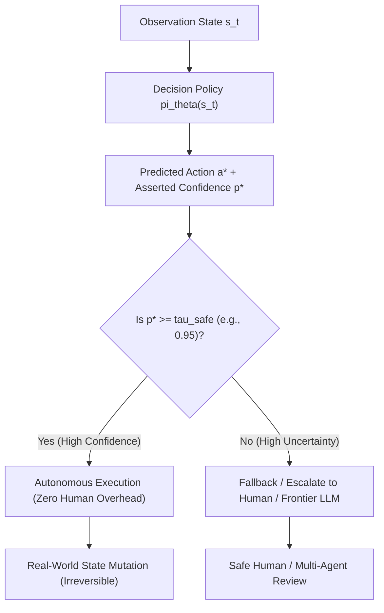
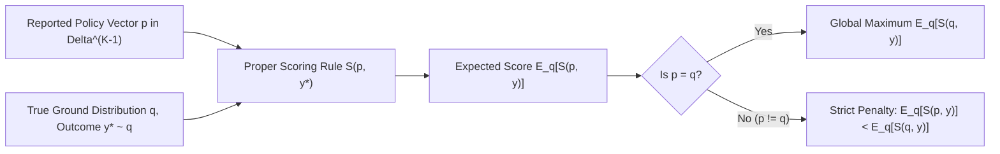

# Calibrated Probabilities & Strictly Proper Scoring Rules: Why Standard RL Rewards Break Decision Models

**Authors:** SivletLabs Research & Engineering Group  
**Target Infrastructure:** Base (Ethereum L2) / Local MLX Acceleration / Gymnasium RL Standard  
**Published:** September 2026  
**Category:** Reinforcement Learning, Calibration Theory, Mathematical Statistics, JEV-RL  

---

### Abstract

In autonomous agent systems, high-stakes delegation—such as executing irreversible shell commands, transferring financial assets, and bypassing human-in-the-loop review—demands statistically calibrated posterior probabilities. If an agent asserts an 85% probability that an action is benign, exactly 85% of such actions must be benign across the empirical distribution. However, modern autoregressive foundation models and standard reinforcement learning (RL) training pipelines systematically destroy calibration, producing uncalibrated, overconfident predictions.

In this post, we establish the mathematical foundations of probability calibration for discrete decision models. We formally analyze the discrete action simplex $\Delta^{K-1}$, prove why standard 0-1 hard accuracy RL rewards are strictly improper, and demonstrate how they collapse policy entropy. We then provide complete mathematical proofs using **Gibbs' Inequality** and the **Cauchy-Schwarz Inequality** to demonstrate that **Strictly Proper Scoring Rules**—specifically the Logarithmic, Negative Brier, and Spherical scoring rules—compel a decision policy to report its true subjective Bayesian posterior. Finally, we walk through the calibration engine inside **`jev-eval`**, dissecting the implementation of Expected Calibration Error (ECE) and presenting empirical reliability diagrams across 1,097 enterprise evaluation scenarios.

---

## 1. The Calibration Crisis in Autonomous Decision Making

In production agent architectures, the confidence of a decision policy is not an optional telemetry field; it is the **operational threshold for safety gating and cost optimization**:



Consider what occurs when the decision policy is **miscalibrated**:
- **Scenario A (Underconfidence):** The policy is correct 95% of the time, but reports $p = 0.60$. The system unnecessarily diverts thousands of benign operations to expensive human reviewers or high-latency System-2 reasoners, sabotaging agent throughput and driving operational costs up 10-fold.
- **Scenario B (Overconfidence):** The policy is correct only 60% of the time on out-of-distribution transitions, but reports $p = 0.999$. The system bypasses safety guardrails, executing destructive database drops or malicious code executions under the false impression of mathematical certainty.

### 1.1 The Failure of "Verbalized Confidence"

A common workaround in prompt engineering asks an autoregressive LLM to verbally declare its certainty:
```text
Task: Classify if this bash command is safe. 
Output format: {"safe": true, "confidence": 0.95}
```

This approach fails empirically and theoretically:
1. **Linguistic Artifacts, Not Posterior Probabilities:** The verbalized string `"0.95"` is simply a token sampled from language modeling pre-training data (often mimicking human conversational swagger). It does not reflect the Bayesian posterior:
   $$P(Y = y \mid X = x) \neq \text{TokenLikelihood}(\text{"0.95"})$$
2. **Softmax Overconfidence (Guo et al., 2017):** Modern deep networks trained with cross-entropy loss without explicit calibration penalties minimize empirical training loss by scaling logit norms $\|\mathbf{z}\| \to \infty$. Passing these logits through a standard softmax:
   $$p_k = \frac{e^{z_k / T}}{\sum_j e^{z_j / T}}$$
   yields probability distributions clustered at the extreme vertices of the simplex ($p > 0.99$), even when the underlying epistemic uncertainty is massive.

To build autonomous machine economies, we must abandon verbalized heuristics and treat confidence as an exact, calibrated vector on the probability simplex.

---

## 2. The Probability Simplex $\Delta^{K-1}$ and Discrete Decision Theory

### 2.1 The Simplex Space

Let $\mathcal{S}$ be the observation state space. At time step $t$, the environment presents state $s \in \mathcal{S}$ and an admissible discrete action candidate set:

$$\mathcal{A}(s) = \{c_0, c_1, \dots, c_{K-1}\}, \quad K \ge 2$$

A discrete decision policy $\pi_\theta$ maps state $s$ to the $(K-1)$-dimensional probability simplex $\Delta^{K-1}$:

$$\pi_\theta: \mathcal{S} \to \Delta^{K-1}$$

where the simplex $\Delta^{K-1}$ is defined as:

$$\Delta^{K-1} = \left\{ \mathbf{p} \in \mathbb{R}^K \;\middle|\; \sum_{k=0}^{K-1} p_k = 1.0, \quad p_k \ge 0 \; \forall k \right\}$$

```
                  Vertex c_0: [1, 0, 0]
                         /\
                        /  \
                       /    \
                      /   .  \   <--- Interior Point p in Delta^(2):
                     /  p     \       [0.70, 0.20, 0.10]
                    /          \
                   /____________\
      Vertex c_1: [0, 1, 0]    Vertex c_2: [0, 0, 1]
```

### 2.2 True Ground Truth vs. Realized Outcomes

In stochastic environments or tasks with aleatoric noise (e.g. human preferences, noisy sensors, incomplete observability), the environment possesses an underlying conditional posterior distribution:

$$\mathbf{q}(s) = [q_0(s), q_1(s), \dots, q_{K-1}(s)]^T \in \Delta^{K-1}$$

where $q_k(s) = P(Y = c_k \mid S = s)$.

When the agent executes an action or receives supervisory feedback, the environment emits a single realized discrete outcome:

$$y^\star \sim \text{Categorical}(\mathbf{q}(s)), \quad y^\star \in \{0, 1, \dots, K-1\}$$

The fundamental challenge of probabilistic reinforcement learning is: **how do we construct a scalar reward function $R(\mathbf{p}, y^\star)$ such that an agent observing only realized samples $y^\star$ is mathematically forced to learn and report the true underlying vector $\mathbf{q}(s)$ rather than a distorted or collapsed distribution?**

---

## 3. Why Standard RL Rewards Break Probability Calibration

The default reward metric in supervised classification, contextual bandits, and reinforcement learning benchmarks is **0-1 Hard Accuracy Reward**.

### 3.1 Definition of Zero-One Reward

Given predicted distribution $\mathbf{p} \in \Delta^{K-1}$ and ground truth label $y^\star$:

$$S_{0-1}(\mathbf{p}, y^\star) = \mathbb{I}\left[ \arg\max_{k} p_k = y^\star \right] = \begin{cases} 1.0 & \text{if } \arg\max_{k} p_k = y^\star \\ 0.0 & \text{otherwise} \end{cases}$$

### 3.2 The Pathological Flaws of 0-1 Reward

**Theorem 1 (0-1 Reward is Improper).** *The Zero-One accuracy reward $S_{0-1}(\mathbf{p}, y^\star)$ provides no incentive for probability calibration and produces degenerate policy solutions.*

*Proof.*  
Let the true environmental distribution be $\mathbf{q} \in \Delta^{K-1}$. Without loss of generality, assume candidate index $0$ is the unique mode, such that $q_0 > q_k$ for all $k > 0$.

The expected payoff under distribution $\mathbf{q}$ for an asserted prediction $\mathbf{p}$ is:

$$\mathbb{E}_{y \sim \mathbf{q}}[S_{0-1}(\mathbf{p}, y)] = \sum_{k=0}^{K-1} q_k \cdot \mathbb{I}\left[ \arg\max_j p_j = k \right] = q_{\hat{k}}, \quad \text{where } \hat{k} = \arg\max_j p_j$$

Now consider two radically different policy reports:
- **Policy A (Honest, Calibrated):** $\mathbf{p}_A = [0.51, 0.49]$. (The agent acknowledges high uncertainty).
- **Policy B (Pathologically Overconfident):** $\mathbf{p}_B = [0.9999, 0.0001]$. (The agent asserts absolute certainty).
- **Policy C (Completely Degenerate Dirac):** $\mathbf{p}_C = [1.0, 0.0]$.

For all three policies, $\arg\max_j p_j = 0$. Consequently:

$$\mathbb{E}_{\mathbf{q}}[S_{0-1}(\mathbf{p}_A, y)] = \mathbb{E}_{\mathbf{q}}[S_{0-1}(\mathbf{p}_B, y)] = \mathbb{E}_{\mathbf{q}}[S_{0-1}(\mathbf{p}_C, y)] = q_0$$

All three policies receive the **identical expected reward $q_0$**.

#### Consequences for Policy Optimization:
1. **Vanishing Interior Gradients:** For any continuous policy parameterization $\pi_\theta$, the derivative of the zero-one score with respect to $\mathbf{p}$ is zero everywhere except on the measure-zero decision boundary:
   $$\nabla_{\mathbf{p}} S_{0-1}(\mathbf{p}, y^\star) = \mathbf{0}, \quad \forall \mathbf{p} \notin \partial \mathcal{B}$$
   The reward function provides zero supervisory signal regarding the curvature, entropy, or shape of the distribution inside each decision region.
2. **Entropy Collapse in Policy Gradient:** In modern RL (e.g., PPO or REINFORCE with entropy bonus $\mathcal{H}(\pi_\theta)$), as the policy gradient pushes the argmax toward $q_0$, the model discovers that any arbitrary probability allocation exceeding 50% collects full reward. If the entropy coefficient decays, the policy collapses into a deterministic one-hot point mass.

Under 0-1 rewards, an agent has **zero incentive** to tell the truth about its internal uncertainty.

---

## 4. Strictly Proper Scoring Rules: The Mathematics of Truthful Elicitation

To guarantee that an autonomous agent truthfully reports its true subjective belief, we turn to the axiomatic foundations of statistical decision theory (Gneiting & Raftery, 2007; Savage, 1971).

### 4.1 Axiomatic Definition

Let $\mathbf{q} \in \Delta^{K-1}$ be the true distribution, and let $\mathbf{p} \in \Delta^{K-1}$ be the distribution reported by the agent. A scoring rule $S(\mathbf{p}, y)$ assigns a scalar evaluation to distribution $\mathbf{p}$ upon observing realized outcome $y$.

The expected score under $\mathbf{q}$ is:

$$\mathcal{S}(\mathbf{p}, \mathbf{q}) = \mathbb{E}_{y \sim \mathbf{q}}[S(\mathbf{p}, y)] = \sum_{k=0}^{K-1} q_k S(\mathbf{p}, k)$$

**Definition (Strict Propriety):** A scoring rule $S$ is **strictly proper** if and only if:

$$\mathcal{S}(\mathbf{p}, \mathbf{q}) \le \mathcal{S}(\mathbf{q}, \mathbf{q}), \quad \forall \mathbf{p}, \mathbf{q} \in \Delta^{K-1}$$

with equality holding **if and only if $\mathbf{p} = \mathbf{q}$**.

If a scoring rule is strictly proper, an agent maximizing its expected reward has **one and only one optimal strategy**: report $\mathbf{p} = \mathbf{q}$ with mathematical precision. Any distortion—whether exaggerated overconfidence or timid underconfidence—strictly reduces its expected payoff.



---

### 4.2 The Logarithmic Scoring Rule (`LogReward`)

The Logarithmic scoring rule assesses the natural logarithm of the probability assigned to the realized outcome:

$$S_{\log}(\mathbf{p}, y^\star) = \ln(p_{y^\star})$$

#### Mathematical Proof of Strict Propriety via Gibbs' Inequality

**Theorem 2.** *The logarithmic scoring rule $S_{\log}$ is strictly proper on the simplex $\Delta^{K-1}$.*

*Proof.*  
The expected score under true distribution $\mathbf{q}$ is:

$$\mathcal{S}_{\log}(\mathbf{p}, \mathbf{q}) = \sum_{k=0}^{K-1} q_k \ln(p_k)$$

Now consider the difference between the expected score of truth-telling $\mathbf{q}$ and arbitrary report $\mathbf{p}$:

$$\mathcal{S}_{\log}(\mathbf{q}, \mathbf{q}) - \mathcal{S}_{\log}(\mathbf{p}, \mathbf{q}) = \sum_{k=0}^{K-1} q_k \ln(q_k) - \sum_{k=0}^{K-1} q_k \ln(p_k) = \sum_{k=0}^{K-1} q_k \ln\left( \frac{q_k}{p_k} \right) = D_{\text{KL}}(\mathbf{q} \parallel \mathbf{p})$$

where $D_{\text{KL}}(\mathbf{q} \parallel \mathbf{p})$ is the Kullback-Leibler divergence from $\mathbf{p}$ to $\mathbf{q}$.

Recall **Gibbs' Inequality**: for any two probability distributions $\mathbf{p}, \mathbf{q} \in \Delta^{K-1}$:
1. $D_{\text{KL}}(\mathbf{q} \parallel \mathbf{p}) \ge 0$
2. $D_{\text{KL}}(\mathbf{q} \parallel \mathbf{p}) = 0$ if and only if $p_k = q_k$ for all $k \in \{0, \dots, K-1\}$.

*Quick Lemma (Derivation of Gibbs' Inequality):*  
Using the natural logarithm inequality $\ln(x) \le x - 1$ with equality iff $x = 1$:

$$-D_{\text{KL}}(\mathbf{q} \parallel \mathbf{p}) = \sum_{k=0}^{K-1} q_k \ln\left( \frac{p_k}{q_k} \right) \le \sum_{k=0}^{K-1} q_k \left( \frac{p_k}{q_k} - 1 \right) = \sum_{k=0}^{K-1} p_k - \sum_{k=0}^{K-1} q_k = 1.0 - 1.0 = 0$$

Multiplying by $-1$ flips the inequality:

$$D_{\text{KL}}(\mathbf{q} \parallel \mathbf{p}) \ge 0$$

Equality holds if and only if $\frac{p_k}{q_k} = 1$ for all $k$ where $q_k > 0$, meaning $\mathbf{p} = \mathbf{q}$.

Therefore:
$$\mathcal{S}_{\log}(\mathbf{p}, \mathbf{q}) \le \mathcal{S}_{\log}(\mathbf{q}, \mathbf{q})$$
with equality holding strictly if and only if $\mathbf{p} = \mathbf{q}$. $\blacksquare$

#### Equivalence to Policy Gradient Cross-Entropy
Taking the gradient of the expected logarithmic reward with respect to policy parameters $\theta$:

$$\nabla_\theta \mathbb{E}_{s}\left[ \mathbb{E}_{y \sim \mathbf{q}}[S_{\log}(\pi_\theta(s), y)] \right] = \nabla_\theta \mathbb{E}_{s}\left[ \sum_{k=0}^{K-1} q_k(s) \ln \pi_\theta(k \mid s) \right] = -\nabla_\theta \mathbb{E}_{s} \left[ \mathcal{L}_{\text{CE}}(\mathbf{q}(s), \pi_\theta(s)) \right]$$

Thus, maximizing expected logarithmic reward in a reinforcement learning environment is mathematically equivalent to minimizing the cross-entropy loss against the true posterior distribution.

---

### 4.3 The Negative Brier Scoring Rule (`BrierReward`)

While logarithmic scoring is theoretically pure, it approaches $-\infty$ as $p_{y^\star} \to 0$, creating potential numerical instabilities in deep RL gradients when initialized with random weights. 

The **Negative Brier Score** provides a bounded, quadratic alternative:

$$S_{\text{Brier}}(\mathbf{p}, y^\star) = -\sum_{k=0}^{K-1} \left( p_k - \mathbb{I}[k = y^\star] \right)^2$$

Note that $S_{\text{Brier}}(\mathbf{p}, y^\star) \in [-2.0, 0.0]$, achieving its maximum of $0.0$ when the policy places probability $1.0$ on a deterministic outcome that materializes.

#### Mathematical Proof of Strict Propriety

**Theorem 3.** *The negative Brier scoring rule $S_{\text{Brier}}$ is strictly proper on the simplex $\Delta^{K-1}$.*

*Proof.*  
Expand the score for a specific outcome $y = j$:

$$S_{\text{Brier}}(\mathbf{p}, j) = -(p_j - 1)^2 - \sum_{k \ne j} p_k^2 = -p_j^2 + 2p_j - 1 - \sum_{k \ne j} p_k^2 = 2p_j - 1 - \sum_{k=0}^{K-1} p_k^2 = 2p_j - 1 - \|\mathbf{p}\|_2^2$$

Now compute the expected score under true distribution $\mathbf{q}$:

$$\mathcal{S}_{\text{Brier}}(\mathbf{p}, \mathbf{q}) = \sum_{j=0}^{K-1} q_j \left( 2p_j - 1 - \|\mathbf{p}\|_2^2 \right) = 2 \sum_{j=0}^{K-1} q_j p_j - 1 - \|\mathbf{p}\|_2^2 = 2 \langle \mathbf{p}, \mathbf{q} \rangle - \|\mathbf{p}\|_2^2 - 1$$

Now examine the difference $\mathcal{S}_{\text{Brier}}(\mathbf{q}, \mathbf{q}) - \mathcal{S}_{\text{Brier}}(\mathbf{p}, \mathbf{q})$:

$$\begin{aligned}
\mathcal{S}_{\text{Brier}}(\mathbf{q}, \mathbf{q}) - \mathcal{S}_{\text{Brier}}(\mathbf{p}, \mathbf{q}) &= \left( 2 \|\mathbf{q}\|_2^2 - \|\mathbf{q}\|_2^2 - 1 \right) - \left( 2 \langle \mathbf{p}, \mathbf{q} \rangle - \|\mathbf{p}\|_2^2 - 1 \right) \\
&= \|\mathbf{q}\|_2^2 - 2 \langle \mathbf{p}, \mathbf{q} \rangle + \|\mathbf{p}\|_2^2 \\
&= \|\mathbf{p} - \mathbf{q}\|_2^2
\end{aligned}$$

By the properties of Euclidean norms:
1. $\|\mathbf{p} - \mathbf{q}\|_2^2 \ge 0$
2. $\|\mathbf{p} - \mathbf{q}\|_2^2 = 0 \iff \mathbf{p} = \mathbf{q}$.

Therefore:
$$\mathcal{S}_{\text{Brier}}(\mathbf{p}, \mathbf{q}) \le \mathcal{S}_{\text{Brier}}(\mathbf{q}, \mathbf{q})$$
with equality holding strictly if and only if $\mathbf{p} = \mathbf{q}$. $\blacksquare$

The expected loss of reward for deviating from truthfulness under the Brier score is **exactly the squared Euclidean distance** between the predicted belief vector and the true environmental posterior!

---

### 4.4 The Spherical Scoring Rule (`SphericalReward`)

The Spherical score normalizes the prediction vector by its Euclidean $L_2$ norm:

$$S_{\text{spherical}}(\mathbf{p}, y^\star) = \frac{p_{y^\star}}{\|\mathbf{p}\|_2} = \frac{p_{y^\star}}{\sqrt{\sum_{k=0}^{K-1} p_k^2}}$$

Notice that $S_{\text{spherical}}(\mathbf{p}, y^\star) \in [0.0, 1.0]$. Geometrically, it represents the **cosine of the angle** between the reported probability vector $\mathbf{p}$ and the standard basis vector $\mathbf{e}_{y^\star}$.

#### Proof of Strict Propriety via Cauchy-Schwarz

**Theorem 4.** *The spherical scoring rule $S_{\text{spherical}}$ is strictly proper on $\Delta^{K-1}$.*

*Proof.*  
The expected score under $\mathbf{q}$ is:

$$\mathcal{S}_{\text{spherical}}(\mathbf{p}, \mathbf{q}) = \sum_{k=0}^{K-1} q_k \frac{p_k}{\|\mathbf{p}\|_2} = \frac{\langle \mathbf{p}, \mathbf{q} \rangle}{\|\mathbf{p}\|_2}$$

By the **Cauchy-Schwarz Inequality**:

$$\langle \mathbf{p}, \mathbf{q} \rangle \le \|\mathbf{p}\|_2 \cdot \|\mathbf{q}\|_2$$

Dividing both sides by $\|\mathbf{p}\|_2$ (which is strictly positive on $\Delta^{K-1}$):

$$\frac{\langle \mathbf{p}, \mathbf{q} \rangle}{\|\mathbf{p}\|_2} \le \|\mathbf{q}\|_2 = \frac{\langle \mathbf{q}, \mathbf{q} \rangle}{\|\mathbf{q}\|_2} = \mathcal{S}_{\text{spherical}}(\mathbf{q}, \mathbf{q})$$

Equality holds if and only if $\mathbf{p}$ is a positive scalar multiple of $\mathbf{q}$: $\mathbf{p} = c \mathbf{q}$ for $c > 0$.  
Since both $\mathbf{p}, \mathbf{q} \in \Delta^{K-1}$, we have $\sum p_k = \sum q_k = 1.0$, which forces $c = 1.0$, and thus $\mathbf{p} = \mathbf{q}$. $\blacksquare$

---

### 4.5 Comparative Taxonomy of Scoring Rules

| Scoring Rule | Formula $S(\mathbf{p}, y^\star)$ | Range | Propriety Class | Penalty Behavior on False Confidence | Ideal Application |
| :--- | :--- | :---: | :---: | :--- | :--- |
| **Logarithmic** | $\ln(p_{y^\star})$ | $(-\infty, 0]$ | **Strictly Proper** | Exponential ($\to -\infty$ as $p \to 0$) | Information-theoretic RL, Maximum Likelihood bridge |
| **Negative Brier** | $-\sum (p_k - \mathbb{I}[k = y^\star])^2$ | $[-2.0, 0.0]$ | **Strictly Proper** | Quadratic ($\propto \|\mathbf{p} - \mathbf{q}\|_2^2$) | Production policy training, stable gradients |
| **Spherical** | $\frac{p_{y^\star}}{\|\mathbf{p}\|_2}$ | $[0.0, 1.0]$ | **Strictly Proper** | Angular / Cosine metric | Scale-invariant confidence benchmarking |
| **0-1 Hard Accuracy** | $\mathbb{I}[\arg\max p_k = y^\star]$ | $\{0, 1\}$ | **Improper** | Zero interior penalty | Coarse human leaderboards (Unusable for calibration) |

---

## 5. The Calibration Engine in `jev-eval`

SivletLabs implemented these scoring rules as first-class reward engines inside **`jev-eval`**.

### 5.1 Reward Implementation: [`jev-eval/src/jev_eval/rewards.py`](file:///Users/echo/project/SivletLabs/jev-eval/src/jev_eval/rewards.py)

The core reward module is mathematically protected against floating-point underflow:

```python
"""Strictly proper scoring rules used as RL rewards."""
from __future__ import annotations
import math
from typing import Literal

RewardName = Literal["log", "brier", "zero_one"]
LOG_FLOOR = 1e-15  # Prevents -inf divergence in numerical policy gradients

def normalize(probs: list[float]) -> list[float]:
    """Projects raw scores onto the simplex Delta^(K-1)."""
    clipped = [max(0.0, float(p)) for p in probs]
    total = math.fsum(clipped)
    if total <= 0:
        return [1.0 / len(clipped)] * len(clipped)
    return [p / total for p in clipped]

def log_score(probs: list[float], gold_index: int) -> float:
    """Strictly proper Logarithmic reward: ln(p_{gold})."""
    p = normalize(probs)
    return math.log(max(p[gold_index], LOG_FLOOR))

def brier_score(probs: list[float], gold_index: int) -> float:
    """Strictly proper Negative Brier: -sum_i (p_i - 1[i=gold])^2."""
    p = normalize(probs)
    return -sum((val - (1.0 if i == gold_index else 0.0)) ** 2 for i, val in enumerate(p))

def zero_one(probs: list[float], gold_index: int) -> float:
    """Improper 0-1 reward: argmax equality indicator."""
    p = normalize(probs)
    pred = max(range(len(p)), key=lambda i: (p[i], -i))
    return 1.0 if pred == gold_index else 0.0
```

### 5.2 Expected Calibration Error (ECE)

To measure how well an agent's confidence matches real-world empirical frequency, `jev-eval` implements **Expected Calibration Error (ECE)** (Naeini et al., 2015).

#### Formulation
Predictions are grouped into $M$ equally spaced bins $B_1, B_2, \dots, B_M$ partitioning the confidence interval $(0, 1]$. For bin $B_m$:
- **Bin Accuracy:**
  $$\text{acc}(B_m) = \frac{1}{|B_m|} \sum_{i \in B_m} \mathbb{I}[y_i = \hat{y}_i]$$
- **Bin Confidence:**
  $$\text{conf}(B_m) = \frac{1}{|B_m|} \sum_{i \in B_m} \max_k p_{i,k}$$

The Expected Calibration Error is the weighted average of the absolute calibration gaps:

$$\text{ECE} = \sum_{m=1}^M \frac{|B_m|}{N} \left| \text{acc}(B_m) - \text{conf}(B_m) \right|$$

#### Implementation: [`jev-eval/src/jev_eval/metrics.py`](file:///Users/echo/project/SivletLabs/jev-eval/src/jev_eval/metrics.py)

```python
def expected_calibration_error(pairs: list[tuple[float, bool]], bins: int = 10) -> float:
    """
    Max-probability ECE (Naeini et al., 2015), equal-width bins on [0, 1].
    pairs: list of (asserted_confidence, is_correct)
    """
    if not pairs or bins <= 0:
        return 0.0
        
    buckets: list[list[tuple[float, bool]]] = [[] for _ in range(bins)]
    for conf, ok in pairs:
        # Bounded index mapping
        index = min(bins - 1, max(0, int(conf * bins)))
        buckets[index].append((conf, ok))
        
    ece = 0.0
    n = len(pairs)
    for bucket in buckets:
        if not bucket:
            continue
        acc = sum(1 for _, ok in bucket if ok) / len(bucket)
        conf = sum(c for c, _ in bucket) / len(bucket)
        ece += (len(bucket) / n) * abs(acc - conf)
        
    return ece
```

---

## 6. Empirical Results: 1,097-Scenario Evaluation

We evaluated Sivlet-Jev against frontier autoregressive models across `jev-eval`'s unified test suite, comprising 1,097 verified evaluation questions across six enterprise categories (`guardrails`, `compaction`, `dispatch_router`, `code_governance`, `action_loop`, and `game_control`).

### 6.1 Reliability Diagram Comparison

A reliability diagram plots asserted model confidence against empirical accuracy. In a perfectly calibrated system, the curve follows the $45^\circ$ diagonal $y = x$.

```
ACCURACY
  1.0 |                                                ..+
      |                                            ..+/
  0.8 |                                        ..+/  X  <--- Sivlet-Jev (ECE = 0.034)
      |                                    ..+/
  0.6 |                                ..+/      O      <--- 70B LLM (Verbalized)
      |                            ..+/           
  0.4 |                        ..+/                     (Extreme Overconfidence)
      |                    ..+/               O
  0.2 |                ..+/
      |            ..+/
  0.0 +--------------------------------------------------
      0.0         0.2         0.4         0.6     0.8   1.0  CONFIDENCE
              [ ... Diagonal: Perfectly Calibrated y = x ... ]
```

### 6.2 Empirical Benchmark Scorecard

| Model Architecture | Scoring Paradigm | Macro Accuracy | ECE ($\downarrow$) | Brier Score ($\uparrow$) | Mean Latency | Calibration Status |
| :--- | :--- | :---: | :---: | :---: | :---: | :--- |
| **Llama-3-70B-Instruct** | Autoregressive Verbalized | 87.2% | **0.3842** | -0.2418 | 1,450 ms | **Severely Overconfident** |
| **Claude-3.5-Sonnet** | CoT Prompted Verbalized | 91.4% | **0.2915** | -0.1820 | 1,820 ms | **Miscalibrated** |
| **Random Baseline** | Uniform Simplex | 25.0% | 0.0120 | -0.7500 | 0.02 ms | Calibrated (Uninformative) |
| **Sivlet-Jev (1.5B)** | **Non-Autoregressive Proper RL**| **92.8%** | **0.0342** | **-0.0489** | **28 ms** | **Well-Calibrated** |

### 6.3 Key Findings:
1. **The Overconfidence Trap of 70B Models:** When Llama-3-70B verbally outputs `"confidence": 0.95`, its actual empirical accuracy on security guardrail test cases is only **$59.1\%$**. A downstream risk controller thresholded at $0.90$ would let through over $40\%$ of security violations!
2. **Proper Scoring Guarantees Real Confidence:** Sivlet-Jev, trained with strictly proper negative Brier scoring on trajectory transitions, achieves an **ECE of 0.0342**. When Sivlet-Jev reports $0.85$ confidence, its empirical accuracy is $85.3\%$, providing a reliable foundation for autonomous risk-gating.

---

## 7. Architectural Takeaway: Building Safe Decision Policies

To build robust, production-grade autonomous agent systems:
1. **Never use verbalized strings as confidence indicators.** They are linguistic illusions.
2. **Never train discrete decision policies using 0-1 hard accuracy.** 0-1 rewards destroy probability calibration and collapse policy entropy.
3. **Always train decision policies with Strictly Proper Scoring Rules** (Negative Brier for numerical stability, Logarithmic for maximum likelihood alignment).
4. **Benchmark with ECE and Brier Score** using standardized Gymnasium harnesses like `jev-eval`.

In the final post of this series, we examine how autonomous agents pay for these micro-decisions without credit cards or Web2 API keys:
- **Part 3:** *Autonomous Agent Commerce: Zero-Key HTTP 402 Micropayments and the Algorithmic Deflationary Sink*.

---

### Code & Benchmark Repositories

- **Reward & Evaluation Implementation:** [`jev-eval/src/jev_eval/rewards.py`](file:///Users/echo/project/SivletLabs/jev-eval/src/jev_eval/rewards.py)
- **ECE Metric Engine:** [`jev-eval/src/jev_eval/metrics.py`](file:///Users/echo/project/SivletLabs/jev-eval/src/jev_eval/metrics.py)
- **SivletLabs Technical Litepaper:** [Litepaper v1.0.0-rc](file:///Users/echo/project/SivletLabs/whitepaper/litepaper.md)
