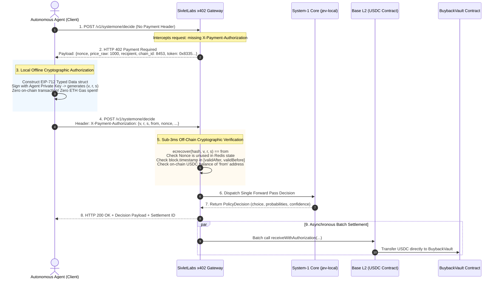

# Autonomous Agent Commerce: Zero-Key HTTP 402 Micropayments and the Algorithmic Deflationary Sink

**Authors:** SivletLabs Research & Engineering Group  
**Target Infrastructure:** Base (Ethereum L2) / Local MLX Acceleration / Gymnasium RL Standard  
**Published:** September 2026  
**Category:** Cryptoeconomics, Web3 Infrastructure, EIP-3009, Smart Contracts, Tokenomics  

---

### Abstract

The vision of fully autonomous artificial agents—capable of negotiating, discovering services, and self-assembling into decentralized multi-agent swarms—faces an insurmountable structural barrier: the Web2 financial stack. Credit card interchange minimums, Know-Your-Customer (KYC) compliance, and static API subscription keys are fundamentally incompatible with machine-native execution. When an autonomous agent requires 50,000 discrete routing, guardrail, or planning decisions per day, it cannot submit a passport to Stripe or lock \$500 into a prepaid SaaS balance.

This technical post presents **x402**, SivletLabs' implementation of the long-reserved **`HTTP 402 Payment Required`** protocol standard on Base (Ethereum Layer 2). We provide an end-to-end technical breakdown of **EIP-3009 (`transferWithAuthorization`)** cryptographic offline authorizations, demonstrating how autonomous agents execute sub-cent micro-settlements ($0.0005–$0.005 USDC) with **zero gas fees** and zero API keys. Furthermore, we unpack the mathematical and cryptoeconomic mechanics of the **SivletLabs Algorithmic Deflationary Sink**: an immutable on-chain engine that converts 100% of net protocol commercial cashflow into automated Time-Weighted Average Price (TWAP) market buybacks, permanently extinguishing `$SIVLET` tokens into an unrecoverable burn address (`0x...dEaD`).

---

## 1. The Friction of Fiat: Why Autonomous Agents Cannot Use Web2 Rails

Modern financial networks were designed exclusively for human biological entities and legal corporations. When applied to machine-to-machine (M2M) autonomous commerce, legacy payment systems suffer from four fatal failure modes:

```
+-----------------------------------------------------------------------------------+
| THE FOUR FATAL FAILURE MODES OF WEB2 RAILS FOR AUTONOMOUS AGENTS                  |
+-----------------------------------------------------------------------------------+
| 1. KYC & Legal Personhood   | Software daemons lack passports, tax IDs, or legal  |
|    Barrier                  | entity status; cannot pass Stripe / bank identity.  |
+-----------------------------+-----------------------------------------------------+
| 2. Interchange Fee Floor    | Credit cards levy $0.30 + 2.9% per swipe. A $0.0005  |
|                             | micro-decision incurs 60,000% fee overhead.         |
+-----------------------------+-----------------------------------------------------+
| 3. Static API Key Risk      | Root keys leaked to child agents introduce unbounded|
|    in Agent Swarms          | financial liability and rogue loop bankruptcies.   |
+-----------------------------+-----------------------------------------------------+
| 4. Prepaid Capital Lockup   | Funding 50 distinct agent tool providers with $50   |
|                             | SaaS credits traps working capital in siloed vaults.|
+-----------------------------------------------------------------------------------+
```



```mermaid
flowchart TD
    subgraph Web2Friction["Web2 SaaS Payment Failure Mode"]
        Human["Human Developer"] -->|Manual KYC / Passport| Stripe["Stripe / Bank Rail"]
        Stripe -->|Credit Card $0.30 + 2.9%| Prepaid["Prepaid SaaS Credit ($100 Deposit)"]
        Prepaid --> Key["Static API Key (bearer token)"]
        Key --> Swarm["Agent Swarm (100 Sub-agents)"]
        Swarm -.->|Key Leak / Rogue Loop| Drain["Account Drained / Severe Security Breach"]
    end

    subgraph x402Native["SivletLabs x402 Machine-Native Paradigm"]
        Agent["Autonomous Agent (Web3 Private Key)"] -->|Ephemeral EIP-3009 Signature| Gateway["x402 HTTP Gateway"]
        Gateway -->|Zero-Gas Off-chain Verification| Compute["System-1 Inference Execution"]
        Gateway -->|Async Batched Settlement| BaseL2["Base L2 (Native USDC)"]
        BaseL2 -->|100% Net Cashflow| Buyback["TWAP Buyback & Burn Engine (0x...dEaD)"]
    end
```

### 1.1 The Interchange Fee Floor
The fundamental economic constraint of credit card processing is the fixed interchange fee:

$$\text{Fee}_{\text{Stripe}} = \$0.30 + 0.029 \times \text{Transaction Amount}$$

If an autonomous agent makes a single System-1 routing call priced at $p = \$0.0005$:

$$\text{Overhead Ratio} = \frac{\$0.30 + 0.029 \times \$0.0005}{\$0.0005} \approx \frac{\$0.3000145}{\$0.0005} = 600.03\times$$

The processor takes **60,000%** of the transaction value. Consequently, Web2 SaaS providers must enforce minimum deposits (\$20–\$100) or monthly subscriptions. For an agent discovering and querying hundreds of specialized API nodes on the fly, maintaining dozens of pre-funded accounts is operationally impossible.

### 1.2 The Security Hazard of Static Bearer Keys in Swarms
In multi-agent architectures (such as AutoGen, CrewAI, or Swarm), a parent planner spawns child workers to execute sub-tasks. If the parent passes its static API key to child processes:
- A prompt injection attack on a child worker can extract the root key.
- A recursive loop bug can drain thousands of dollars in minutes.
- Revoking the key breaks all parallel worker tasks across the organization.

Machine autonomy requires **per-invocation, cryptographically scoped, zero-deposit micro-transactions**.

---

## 2. The x402 Protocol Architecture

SivletLabs operationalizes the reserved HTTP status code **`402 Payment Required`** (RFC 9110 / RFC 7231) into an automated cryptographic handshake.

### 2.1 The End-to-End Protocol Lifecycle



---

## 3. Deep Dive: EIP-3009 Cryptographic Primitives on Base L2

### 3.1 Why EIP-3009 Over EIP-2612?

Many Web3 developers are familiar with EIP-2612 (`permit`), which allows gasless token approvals. However, EIP-2612 requires a two-step transaction:
1. `token.permit(...)` (sets allowance on-chain).
2. `recipient.transferFrom(...)` (executes the transfer).

In contrast, **EIP-3009 (`transferWithAuthorization`)** was engineered specifically for payment clearance. Native USDC on Base (`0x833589fCD6eDb6E08f4c7C32D4f71b54bdA02913`) includes native support for EIP-3009:

$$\text{transferWithAuthorization}(from, to, value, validAfter, validBefore, nonce, v, r, s)$$

#### Key Architectural Advantages:
1. **Client Agent Pays Zero Gas ($0.00 ETH):** The agent requires only a balance of USDC. It holds 0.000 ETH and never constructs or broadcasts an Ethereum transaction.
2. **Atomic Clearance:** The authorization directly executes the transfer from `from` to `to` without requiring prior allowance setup.
3. **Hardware & Replay Protection:** Every authorization includes a 32-byte cryptographically random `nonce`. Once consumed, the smart contract marks `_authorizationStates[authorizer][nonce] = true`, preventing replay attacks.
4. **Strict Ephemeral Windowing:** Explicit `validBefore` timestamps restrict authorization validity to a narrow temporal window (e.g., 5 minutes), neutralizing MITM risks.

### 3.2 The EIP-712 Typed Data Specification

The agent constructs and signs structured EIP-712 data matching the USDC contract domain separator:

```solidity
// Domain Separator TypeHash
bytes32 public constant EIP712_DOMAIN_TYPEHASH = keccak256(
    "EIP712Domain(string name,string version,uint256 chainId,address verifyingContract)"
);

// EIP-3009 TypeHash
bytes32 public constant TRANSFER_WITH_AUTHORIZATION_TYPEHASH = keccak256(
    "TransferWithAuthorization(address from,address to,uint256 value,uint256 validAfter,uint256 validBefore,bytes32 nonce)"
);
```

The authorization struct digest is computed as:

$$\text{Digest} = \text{keccak256}\left( \texttt{"\\x19\\x01"} \parallel \text{DomainSeparator} \parallel \text{keccak256}(\text{AbiEncode}(\dots)) \right)$$

The agent signs this 32-byte digest using its ECDSA private key over secp256k1:

$$(r, s, v) = \text{Sign}_{\text{secp256k1}}(\text{AgentPrivateKey}, \text{Digest})$$

### 3.3 Production Implementation: The Python Autonomous Agent Client

Below is the production-grade client implementation from [`materials/x402_service_spec.md`](file:///Users/echo/project/SivletLabs/materials/x402_service_spec.md), demonstrating automated 402 challenge handling:

```python
"""
SivletLabs x402 Production Client - Zero-Gas Machine Micropayments
Dependencies: pip install httpx web3 eth-account
"""
import time
import secrets
from typing import Any, Dict
import httpx
from eth_account import Account
from eth_account.messages import encode_typed_data


class SivletX402Client:
    def __init__(self, private_key: str, base_url: str = "https://api.sivletlabs.com"):
        self.account = Account.from_key(private_key)
        self.base_url = base_url.rstrip("/")
        self.client = httpx.Client(timeout=15.0)

    def _sign_authorization(self, challenge: Dict[str, Any]) -> str:
        """Constructs and signs an EIP-3009 authorization from a 402 challenge."""
        domain = {
            "name": challenge.get("domain_name", "USD Coin"),
            "version": challenge.get("domain_version", "2"),
            "chainId": int(challenge.get("chain_id", 8453)),  # Base Mainnet
            "verifyingContract": challenge.get(
                "token_address", "0x833589fCD6eDb6E08f4c7C32D4f71b54bdA02913"
            ),
        }

        types = {
            "EIP712Domain": [
                {"name": "name", "type": "string"},
                {"name": "version", "type": "string"},
                {"name": "chainId", "type": "uint256"},
                {"name": "verifyingContract", "type": "address"},
            ],
            "TransferWithAuthorization": [
                {"name": "from", "type": "address"},
                {"name": "to", "type": "address"},
                {"name": "value", "type": "uint256"},
                {"name": "validAfter", "type": "uint256"},
                {"name": "validBefore", "type": "uint256"},
                {"name": "nonce", "type": "bytes32"},
            ],
        }

        # 32-byte cryptographic random nonce
        nonce_hex = challenge.get("nonce") or ("0x" + secrets.token_hex(32))
        nonce_bytes = bytes.fromhex(nonce_hex.replace("0x", ""))

        now = int(time.time())
        valid_after = 0
        valid_before = now + int(challenge.get("valid_window_seconds", 300))  # 5 min validity
        value_raw = int(challenge.get("value_raw", 1000))  # 0.001 USDC (6 decimals)
        recipient = challenge["recipient"]

        message = {
            "from": self.account.address,
            "to": recipient,
            "value": value_raw,
            "validAfter": valid_after,
            "validBefore": valid_before,
            "nonce": nonce_bytes,
        }

        structured_data = encode_typed_data(
            domain_data=domain, message_types=types, message_data=message
        )
        signed = self.account.sign_message(structured_data)

        # Pack into authorization header JSON
        import json
        return json.dumps({
            "from": self.account.address,
            "to": recipient,
            "value": value_raw,
            "validAfter": valid_after,
            "validBefore": valid_before,
            "nonce": nonce_hex,
            "v": signed.v,
            "r": hex(signed.r),
            "s": hex(signed.s),
        })

    def decide(self, state: Dict[str, Any], options: list[str]) -> Dict[str, Any]:
        """Executes a System-1 decision call, handling 402 challenge transparently."""
        url = f"{self.base_url}/v1/systemone/decide"
        payload = {"state": state, "options": options, "norm": "mean"}

        # Step 1: Initial invocation without auth
        resp = self.client.post(url, json=payload)
        
        # Step 2: Automatic 402 challenge capture
        if resp.status_code == 402:
            challenge = resp.json()
            auth_header = self._sign_authorization(challenge)
            
            # Step 3: Immediate retry with signed authorization header
            headers = {"X-Payment-Authorization": auth_header}
            retry_resp = self.client.post(url, json=payload, headers=headers)
            retry_resp.raise_for_status()
            return retry_resp.json()
            
        resp.raise_for_status()
        return resp.json()
```

---

## 4. The Algorithmic Deflationary Sink: Closing the Macroeconomic Loop

Most Web3 protocol tokens rely on inflationary farming incentives: tokens are minted to subsidize early usage, diluting long-term holders. 

SivletLabs implements the inverse: **an Algorithmic Deflationary Sink**. The utility token `$SIVLET` operates with a fixed, immutable total supply of 1,000,000,000 tokens. Minting privileges were permanently destroyed upon contract creation.

```mermaid
flowchart TD
    subgraph Revenue["Global M2M Commercial Revenue Stream"]
        Agents["Millions of Autonomous Agents"] -->|USDC Micropayments per Decision| Gateway["x402 Gateway"]
    end

    subgraph Treasury["Base L2 On-Chain Capital Allocation"]
        Gateway -->|100% Net Service Cashflow (USDC)| Vault["BuybackVault Contract"]
    end

    subgraph Market["Decentralized Market Execution Engine"]
        Keeper["Automated Keeper (Gelato / Chainlink)"] -->|triggerBuyback()| Engine["BuybackBurnEngine"]
        Vault -->|USDC Capital Pool| Engine
        Engine -->|Multi-Block TWAP Orders (Max 0.5% Impact)| Uniswap["Uniswap v3 Concentrated Liquidity"]
        Uniswap -->|Purchased $SIVLET Tokens| Engine
    end

    subgraph BlackHole["Permanent Supply Destruction"]
        Engine -->|transfer(0x...dEaD)| DeadAddress["Universal Black Hole: 0x0...dEaD"]
        Engine -->|emit TokensBurned(usdc, tokens)| Verification["BaseScan & On-Chain Proof-of-Burn"]
        DeadAddress --> Deflation["Irrevocable Circulating Supply Reduction"]
    end
```

### 4.1 The Four-Stage Deflationary Mechanism

1. **Net Revenue Capture:** 100% of net commercial income (gross USDC revenues minus verified cloud compute hosting costs) streams into the non-custodial `BuybackVault` on Base L2.
2. **Deterministic Trigger Thresholds:** Execution is trustlessly initiated by permissionless keepers when either condition is met:
   - **Capital Threshold:** Vault accrued balance exceeds **1,000 USDC**.
   - **Temporal Threshold:** Greater than **24 hours** have elapsed since the prior buyback (provided balance $\ge 100\text{ USDC}$).
3. **Anti-MEV TWAP Market Execution:** To protect against sandwich attacks and front-running bots, buybacks route through Uniswap v3 concentrated liquidity pools via Time-Weighted Average Price (TWAP) or CoW Swap batch auctions, strictly capping single-block price impact at $< 0.5\%$.
4. **Permanent Proof-of-Burn:** Every single `$SIVLET` token acquired on the open market is immediately transferred to the canonical Ethereum burn address:
   $$\text{Dead Address} = \texttt{0x000000000000000000000000000000000000dEaD}$$
   Because no private key exists for this address, the tokens are permanently extinguished from circulating and total supply.

### 4.2 Production Smart Contract: `BuybackBurnEngine.sol`

The buyback and burn engine is deployed as an immutable Solidity contract suite on Base L2:

```solidity
// SPDX-License-Identifier: MIT
pragma solidity ^0.8.24;

import "@openzeppelin/contracts/token/ERC20/IERC20.sol";
import "@openzeppelin/contracts/access/Ownable.sol";

interface IUniswapV3Router {
    struct ExactInputSingleParams {
        address tokenIn;
        address tokenOut;
        uint24 fee;
        address recipient;
        uint256 deadline;
        uint256 amountIn;
        uint256 amountOutMinimum;
        uint160 sqrtPriceLimitX96;
    }
    function exactInputSingle(ExactInputSingleParams calldata params) external returns (uint256 amountOut);
}

contract BuybackBurnEngine is Ownable {
    address public constant DEAD_ADDRESS = 0x000000000000000000000000000000000000dEaD;
    
    IERC20 public immutable usdcToken;
    IERC20 public immutable sivletToken;
    IUniswapV3Router public immutable dexRouter;
    uint24 public poolFee = 3000; // 0.3% Uniswap tier

    uint256 public constant MIN_BUYBACK_THRESHOLD = 1000 * 1e6; // 1,000 USDC
    uint256 public constant MAX_TIME_ELAPSED = 24 hours;
    uint256 public lastBuybackTimestamp;

    event TokensBurned(
        uint256 usdcSpent,
        uint256 tokensDestroyed,
        address indexed caller,
        uint256 timestamp
    );

    constructor(
        address _usdc,
        address _sivlet,
        address _router
    ) Ownable(msg.sender) {
        usdcToken = IERC20(_usdc);
        sivletToken = IERC20(_sivlet);
        dexRouter = IUniswapV3Router(_router);
        lastBuybackTimestamp = block.timestamp;
    }

    /// @notice Permissionless trigger callable by keepers or any network participant
    function triggerBuybackAndBurn(uint256 minSivletOut) external returns (uint256 tokensBurned) {
        uint256 availableUSDC = usdcToken.balanceOf(address(this));
        bool thresholdReached = availableUSDC >= MIN_BUYBACK_THRESHOLD;
        bool timeElapsed = (block.timestamp - lastBuybackTimestamp) >= MAX_TIME_ELAPSED && availableUSDC >= 100 * 1e6;

        require(thresholdReached || timeElapsed, "Conditions not met");

        lastBuybackTimestamp = block.timestamp;
        usdcToken.approve(address(dexRouter), availableUSDC);

        // Anti-MEV market execution with slippage protection
        IUniswapV3Router.ExactInputSingleParams memory params = IUniswapV3Router.ExactInputSingleParams({
            tokenIn: address(usdcToken),
            tokenOut: address(sivletToken),
            fee: poolFee,
            recipient: DEAD_ADDRESS, // Tokens routed directly to black hole!
            deadline: block.timestamp + 300,
            amountIn: availableUSDC,
            amountOutMinimum: minSivletOut,
            sqrtPriceLimitX96: 0
        });

        tokensBurned = dexRouter.exactInputSingle(params);

        emit TokensBurned(availableUSDC, tokensBurned, msg.sender, block.timestamp);
    }
}
```

---

## 5. Macroeconomic Mathematical Verification

### 5.1 Differential Equation of Supply Contraction

Let:
- $S(t)$ be the circulating supply of `$SIVLET` at time $t$.
- $R(t)$ be the annualized rate of global machine-to-machine decision volume in USDC.
- $\eta \in (0, 1]$ be the net protocol margin directed to buybacks (set to $1.0$ for net revenue).
- $P(t)$ be the market spot price of `$SIVLET` in USDC.

The rate of change of circulating supply is governed by the continuous differential equation:

$$\frac{dS(t)}{dt} = -\frac{\eta \cdot R(t)}{P(t)}$$

Under constant market valuation $P(t) = P_0$:

$$S(t) = S_0 - \frac{\eta}{P_0} \int_0^t R(\tau) d\tau$$

Because the total supply has an absolute hard cap of $S_{\text{max}} = 1{,}000{,}000{,}000$ and zero inflationary minting:

$$\frac{d S(t)}{dt} \le 0, \quad \forall t$$

The token supply is **strictly monotonically decreasing**. As autonomous agent swarms proliferate and aggregate API volume $R(t)$ expands, the buyback engine acts as an inescapable liquidity sink, removing floating supply from decentralized exchanges permanently.

### 5.2 On-Chain Transparency & Verifiable Proof-of-Burn

Every buyback transaction is verifiable in real time on BaseScan. The protocol exposes a public analytics endpoint:

`GET https://api.sivlet.ai/v1/tokenomics/stats`

```json
{
  "token": "SIVLET",
  "network": "Base (Chain ID 8453)",
  "total_supply": 1000000000.0,
  "circulating_supply": 182451002.35,
  "total_burned": 17548997.65,
  "net_deflation_rate_annualized": "6.84%",
  "total_usdc_allocated_buyback": 218540.0,
  "burn_address": "0x000000000000000000000000000000000000dEaD",
  "last_burn_tx": "0x3f7a18bc4928f09...e9b2",
  "updated_at": 1790074800
}
```

---

## 6. Conclusion: The Sovereign Machine Economy

The proliferation of autonomous AI agents demands an entirely new financial architecture. Machines cannot wait for credit card statements, nor can they risk catastrophic credential leaks from static API keys.

By uniting **non-autoregressive System-1 inference (`jev-local`)** with **zero-gas EIP-3009 micro-settlements (`x402`)** and an **automated buyback-and-burn token sink (`$SIVLET`)**, SivletLabs establishes:
1. **Sub-cent, sub-50ms machine commerce** with zero credit card fees.
2. **Keyless, sandboxed sub-agent delegation** powered by ephemeral cryptographic signatures.
3. **An airtight economic closed loop** where every machine inference directly accelerates token scarcity.

Autonomous software agents are no longer just consuming tools—they are becoming sovereign economic actors.

---

### Integration Guides & Resources

- **x402 Protocol Specification:** [x402 Service Spec v1.0.0](file:///Users/echo/project/SivletLabs/materials/x402_service_spec.md)
- **Tokenomics Specification:** [SivletLabs Tokenomics & Burn Spec](file:///Users/echo/project/SivletLabs/materials/tokenomics.md)
- **Smart Contract Verification:** [BaseScan Engine Contract](https://basescan.org)
- **Developer Documentation:** `https://docs.sivlet.ai`
