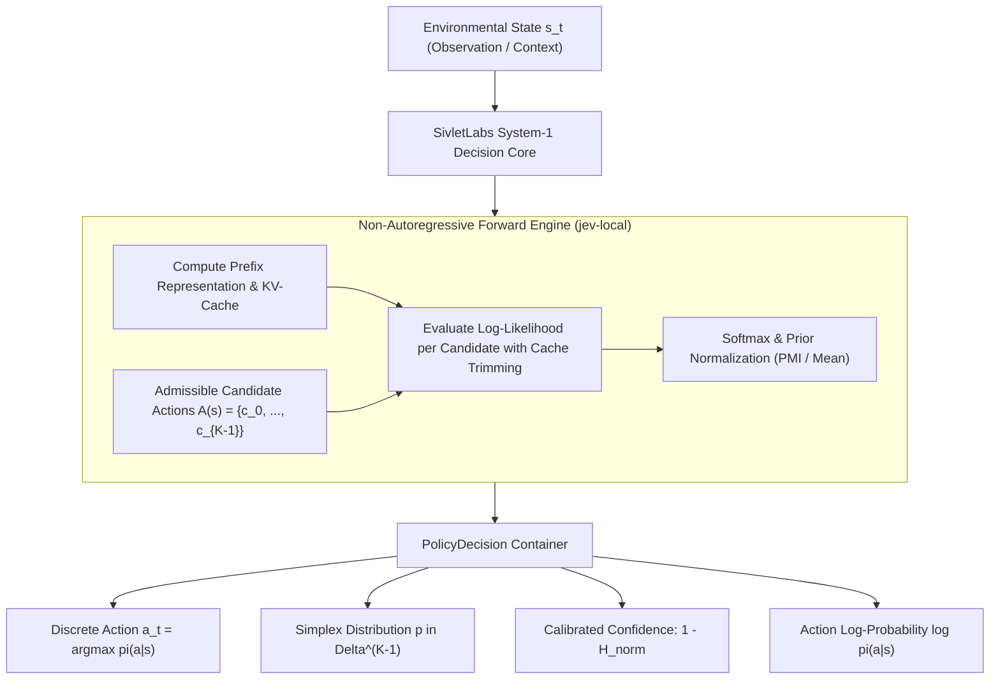
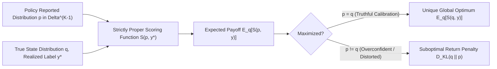
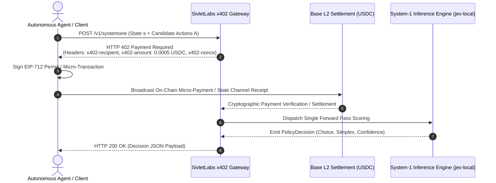

# SivletLabs Litepaper
## Non-Autoregressive System-1 Decision Policies, Rigorous Gymnasium Evaluation, and Autonomous Value Accrual via x402

**Version:** 1.0.0-rc  
**Date:** September 2026  
**Authors:** SivletLabs Research & Engineering Group  
**Target Infrastructure:** Base (Ethereum L2) / Local MLX Acceleration / Gymnasium RL Standard  
**Repository & Source Code:** `https://github.com/SivletLabs`  
**Contact:** `research@sivlet.ai` | `protocol@sivlet.ai`  

---

### Abstract

Modern agentic artificial intelligence architectures rely excessively on autoregressive large language models (LLMs) executing token-by-token sequential decoding. While expressive for generative reasoning and open-ended synthesis (System-2 cognition), autoregressive decoding introduces catastrophic computational inefficiencies, non-deterministic token jitter, unpredictable latency distributions, and uncalibrated confidence estimates when applied to discrete decision-making, deterministic tool dispatch, state-action policy control, and runtime guardrails.

**SivletLabs** establishes a dual-engine paradigm designed for autonomous machine-native environments. First, on the execution front, we formalize and implement **System-1 Non-Autoregressive Forward Scoring (`jev-local`)**: given an environmental observation context and a discrete admissible action set $\mathcal{A}(s) = \{c_0, c_1, \dots, c_{K-1}\}$, the model evaluates the action candidates in a single forward evaluation pass, exploiting prompt KV-cache reuse and cache trimming to emit exact probability distributions $\pi_\theta(\cdot \mid s) \in \Delta^{K-1}$ in sub-50ms latency regimes. Second, on the verification front, we introduce **JEV-RL (`jev-eval`)**, a rigorous, Gymnasium-compliant reinforcement learning and benchmarking framework. JEV-RL models agent interactions as sequential Markov Decision Processes (MDPs) and contextual bandits, integrating Generalized Advantage Estimation (GAE), strictly proper scoring rules (Logarithmic, Brier, and Spherical rewards), and calibration metrics (Expected Calibration Error, normalized Shannon entropy).

Bridging decentralized economic coordination and autonomous agent autonomy, SivletLabs integrates the **x402 machine-native micropayment standard** (HTTP 402 Payment Required). Machine agents stream per-decision stablecoin micro-settlements (USDC on Base L2) without custodial accounts, credit cards, or subscription lock-ins. Crucially, **100% of net protocol service revenue** is autonomously directed into an on-chain algorithmic buyback-and-burn engine: funds route through decentralized exchange liquidity pools via Time-Weighted Average Price (TWAP) execution, and purchased `$SIVLET` utility tokens are permanently routed to an unrecoverable burn address (`0x...dEaD`). This architecture establishes a verifiable, mathematically closed, deflationary cashflow loop tied directly to the global expansion of machine-to-machine decision volume.

---

### Table of Contents

1. [Problem Statement](#1-problem-statement)
   - 1.1 The Autoregressive Trap
   - 1.2 The Calibration Void and Overconfidence
   - 1.3 Fragmentation in Agentic Evaluation
2. [The SivletLabs Solution: System-1 Architecture](#2-the-sivletlabs-solution-system-1-architecture)
   - 2.1 Non-Autoregressive Forward Scoring
   - 2.2 Mathematical Formalization of Discrete Policies
   - 2.3 Strictly Proper Scoring Rules and Truthful Elicitation
3. [The jev-eval Framework](#3-the-jev-eval-framework)
   - 3.1 Gymnasium Compliance & Simulation Zoo
   - 3.2 Rollout Engine & Generalized Advantage Estimation (GAE)
   - 3.3 Calibration, Robustness & Benchmark Scorecards
4. [Monetization via x402: Machine-Native Micropayments](#4-monetization-via-x402-machine-native-micropayments)
   - 4.1 The HTTP 402 Standard for Autonomous Agents
   - 4.2 Pay-Per-Decision vs. Subscription & API Keys
   - 4.3 Service Tiers, SLAs, and Dynamic Pricing
5. [Tokenomics & Value Accrual Mechanism](#5-tokenomics--value-accrual-mechanism)
   - 5.1 $SIVLET Utility & Decentralized Coordination
   - 5.2 The Deflationary Cashflow Loop
   - 5.3 On-Chain Transparency & Verifiable Proof-of-Burn
   - 5.4 Smart Contract Architecture & Event Specifications
   - 5.5 Regulatory, Legal, and Compliance Disclaimers
6. [Roadmap (2026 – 2027)](#6-roadmap-2026--2027)
7. [Risks & Technical Limitations](#7-risks--technical-limitations)
8. [References](#8-references)

---

## 1. Problem Statement

### 1.1 The Autoregressive Trap

The dominant paradigm in autonomous agent systems treats every cognitive operation as a text-generation problem. Autonomous agents powered by autoregressive foundation models (e.g., Llama-3, GPT-4o, Claude 3.5 Sonnet) iteratively sample tokens from a conditional probability distribution:

$$p(y_1, y_2, \dots, y_T \mid x) = \prod_{t=1}^T p(y_t \mid x, y_1, \dots, y_{t-1})$$

When an agent must select an action among $K$ discrete choices—such as routing a query to a specific worker, verifying whether a shell command is destructive, selecting a DOM element to click, or navigating a discrete gridworld—autoregressive decoding suffers from fundamental structural deficiencies:

1. **Computational Waste & FLOP Inefficiency:** Generating text tokens (e.g., `{"action": "navigate_north", "confidence": 0.95}`) requires dozens of sequential forward passes through hundreds of transformer layers. Each emitted token incurs memory bandwidth saturation for KV-cache retrieval, spending billions of floating-point operations on syntax boilerplate rather than probability allocation over the hypothesis space.
2. **Token Latency Jitter:** Autoregressive generation exhibits non-deterministic execution times. A decision that should require 15 milliseconds frequently takes 800 to 3,500 milliseconds due to varying output length, chain-of-thought verbose tokens, and scheduling queues. In real-time control loops (browser automation, dynamic routing, high-frequency execution), such latency jitter disrupts closed-loop stability.
3. **Sampling Stochasticity & Parse Failures:** Autoregressive sampling relies on temperature, Top-$p$, or Min-$p$ heuristics. Even with constrained JSON schema decoders (e.g., grammar-based masking), the underlying model remains vulnerable to hallucinations, token repetitions, schema violations, and unrecoverable syntax parse errors during edge conditions.

```mermaid
flowchart LR
    subgraph AutoregressiveTrap["Autoregressive Generative Decoding (System-2)"]
        direction TB
        Prompt1["State Prompt s"] --> Pass1["Forward Pass 1 (Token '{')"]
        Pass1 --> Pass2["Forward Pass 2 (Token '\"action\"')"]
        Pass2 --> Pass3["... N Forward Passes (Syntax)"]
        Pass3 --> Output1["Output String (High Latency, Jitter, Non-deterministic)"]
    end

    subgraph NonAutoregressive["SivletLabs System-1 Scoring (Direct Simplex)"]
        direction TB
        Prompt2["State Prompt s"] --> KV["Single Forward Pass (Prefix KV-Cache)"]
        KV --> ContScore["Parallel / Trimmed Continuation Evaluation"]
        ContScore --> SimplexOut["Exact Simplex Distribution pi(a|s) in Delta^(K-1) (<50ms)"]
    end
```

### 1.2 The Calibration Void and Overconfidence

A critical prerequisite for autonomous safety and hierarchical delegation is **statistical calibration**: if a decision model assigns an 80% confidence score to a set of actions, exactly 80% of those actions should be correct in expectation.

Modern generative LLMs exhibit extreme miscalibration:
- **Linguistic Prior Drift:** Models show arbitrary token-level biases (e.g., favoring the token `A` over `B` regardless of content, or assigning disproportionate probability mass to affirmative tokens like `Yes`).
- **Overconfidence under Softmax Temperature Scaling:** Cross-entropy training on web corpora encourages sharp, peaky distributions. Consequently, models frequently output extreme certainty ($p > 0.99$) even on completely hallucinated or out-of-distribution transitions.
- **Unnormalized Confidence Heuristics:** When asked to emit verbalized confidence (e.g., `"I am 90% sure"`), models produce uncalibrated linguistic artifacts that correlate poorly with Bayesian posterior probabilities (Guo et al., 2017).

Without well-calibrated posterior probabilities, downstream supervisory controllers cannot establish reliable threshold gates for human escalation, fallback routing, or autonomous permission granting.

### 1.3 Fragmentation in Agentic Evaluation

The field of AI agents currently suffers from an evaluation crisis:
- **Subjective LLM-as-a-Judge Evaluation:** Existing benchmarks frequently use an autoregressive LLM to score the output of another autoregressive LLM, compounding bias, cost, and non-reproducibility.
- **Absence of Standardized RL Environments:** Unlike classical reinforcement learning—which adheres to the rigorous, reproducible API standards established by OpenAI Gym and Farama Gymnasium—agent evaluation is scattered across idiosyncratic scripts, static question-answering dumps, and unversioned web scrapers.
- **Improper Scoring Rule Violations:** Benchmarks routinely evaluate probabilistic models using 0-1 hard accuracy. Hard accuracy ignores predictive distribution variance, provides zero gradient for probability calibration, and incentivizes agents to guess aggressively rather than report uncertainty truthfully.

---

## 2. The SivletLabs Solution: System-1 Architecture

Drawing inspiration from dual-process cognitive psychology (Kahneman, 2011), SivletLabs segregates autonomous reasoning into two distinct regimes:
- **System-2 (Reflective / Generative):** Slow, deliberative, autoregressive multi-step planning, code synthesis, and architectural design.
- **System-1 (Intuitive / Reflexive):** Fast, non-autoregressive, calibrated, fixed-budget decision-making over discrete candidate spaces.

SivletLabs focuses strictly on solving **System-1 decision control** with mathematical purity and hardware-native execution.



### 2.1 Non-Autoregressive Forward Scoring

In the SivletLabs architecture (`jev-local`), decision inference does not generate tokens into an unbounded sequence. Instead, it evaluates a pre-defined set of typed candidate hypotheses against a conditioned state.

#### The KV-Cache Trimming Mechanism
Given a context state text $s$ and a set of $K$ discrete candidate action strings $\mathcal{A}(s) = \{c_0, c_1, \dots, c_{K-1}\}$:

1. **Prefix Forward Pass:** The state $s$ (formatted with domain-specific instruction framing) is tokenized into prefix token IDs $\mathbf{x}_{\text{prefix}} = (x_1, \dots, x_L)$. A single forward pass through the transformer backbone computes the key-value activations:
   $$\mathbf{K}_{\text{prefix}}, \mathbf{V}_{\text{prefix}} = \text{TransformerPrefix}(\mathbf{x}_{\text{prefix}})$$
   and emits the terminal logit vector $\mathbf{z}_L \in \mathbb{R}^{V}$.
2. **Continuation Evaluation:** For each candidate choice $c_k = (w_{k,1}, w_{k,2}, \dots, w_{k,M_k})$:
   - The token IDs of $c_k$ are passed into the model conditioned on the active KV-cache $(\mathbf{K}_{\text{prefix}}, \mathbf{V}_{\text{prefix}})$.
   - The cumulative unnormalized log-probability is computed strictly via forward accumulation:
     $$\log p(c_k \mid s) = \sum_{j=1}^{M_k} \log \text{softmax}(\mathbf{z}_{L+j-1})[w_{k,j}]$$
   - **Cache Trimming:** Instead of allocating $K$ distinct KV-caches in memory or recomputing the prefix $K$ times, the engine dynamically trims the cache back to length $L$ after evaluating $c_k$:
     $$\text{TrimCache}(\mathbf{K}, \mathbf{V}, L)$$
3. **Probability Simplex Construction:** The candidate scores are normalized into a proper probability simplex $\mathbf{p} = (p_0, \dots, p_{K-1}) \in \Delta^{K-1}$:
   $$p_k = \frac{\exp\left(\frac{S(c_k \mid s)}{\tau}\right)}{\sum_{j=0}^{K-1} \exp\left(\frac{S(c_j \mid s)}{\tau}\right)}$$
   where $S(c_k \mid s)$ supports three normalization modes:
   - **Token Mean Normalization:** $S_{\text{mean}}(c_k \mid s) = \frac{1}{M_k} \log p(c_k \mid s)$ (prevents length bias against descriptive action options).
   - **Sum Normalization:** $S_{\text{sum}}(c_k \mid s) = \log p(c_k \mid s)$.
   - **Pointwise Mutual Information (PMI) Calibration:**
     $$S_{\text{pmi}}(c_k \mid s) = \frac{\log p(c_k \mid s) - \log p(c_k \mid \text{neutral})}{M_k}$$
     subtracting unconditioned linguistic priors to ensure choices reflect state evidence rather than surface lexical frequency.

### 2.2 Mathematical Formalization of Discrete Policies

In SivletLabs, interactive environments and single-step decision nodes are formalized under the unified framework of Markov Decision Processes.

#### The Sequential MDP Specification
A discrete-time Markov Decision Process is defined by the 6-tuple:

$$\mathcal{M} = \langle \mathcal{S}, \mathcal{A}, \mathcal{P}, \mathcal{R}, \rho_0, \gamma \rangle$$

where:
- $\mathcal{S}$ is the state space. At time step $t$, the agent receives a structured observation $s_t = \mathcal{O}(S_t) \in \mathcal{S}$.
- $\mathcal{A}(s_t) \subseteq \mathcal{A}$ is the admissible discrete action set:
  $$\mathcal{A}(s_t) = \{ c_0, c_1, \dots, c_{K-1} \}, \quad K \ge 2$$
- $\mathcal{P}: \mathcal{S} \times \mathcal{A} \to \Delta(\mathcal{S})$ represents environmental state transition dynamics:
  $$S_{t+1} \sim \mathcal{P}(\cdot \mid S_t = s_t, A_t = a_t)$$
- $\mathcal{R}: \mathcal{S} \times \mathcal{A} \times \mathcal{S} \to \mathbb{R}$ is the scalar reward function:
  $$r_t = \mathcal{R}(s_t, a_t, s_{t+1})$$
- $\rho_0 \in \Delta(\mathcal{S})$ is the initial state distribution.
- $\gamma \in [0, 1)$ is the temporal discount factor governing the discounted cumulative return:
  $$G_t = \sum_{k=0}^{\infty} \gamma^k r_{t+k}$$

#### Policy Distribution Simplex & Entropy Regularization
A parameterized decision policy $\pi_\theta$ maps observations to the $(K-1)$-dimensional probability simplex:

$$\pi_\theta: \mathcal{S} \to \Delta^{K-1}, \quad \text{where } \Delta^{K-1} = \left\{ \mathbf{p} \in \mathbb{R}^K \;\middle|\; \sum_{k=0}^{K-1} p_k = 1.0, \; p_k \ge 0 \right\}$$

The policy optimization objective maximizes expected cumulative return augmented by Shannon entropy regularization:

$$J(\pi_\theta) = \mathbb{E}_{\tau \sim \pi_\theta} \left[ \sum_{t=0}^T \gamma^t r_t \right] + \beta \mathbb{E}_{s \sim d^\pi} \left[ \mathcal{H}(\pi_\theta(\cdot \mid s)) \right]$$

where $\tau = (s_0, a_0, r_0, s_1, \dots, s_T)$ is the trajectory, $d^\pi(s)$ is the stationary discounted state visitation distribution, $\beta \ge 0$ is the entropy temperature hyperparameter, and Shannon entropy is defined as:

$$\mathcal{H}(\pi_\theta(\cdot \mid s)) = -\sum_{k=0}^{K-1} \pi_\theta(c_k \mid s) \ln \pi_\theta(c_k \mid s)$$

The decision output container `PolicyDecision` encapsulates:
1. **Action Selection:** $a_t = \arg\max_{a} \pi_\theta(a \mid s_t)$ (deterministic inference) or $a_t \sim \pi_\theta(\cdot \mid s_t)$ (stochastic rollout).
2. **Exact Simplex Vector:** $\mathbf{p}_t = [\pi_\theta(c_0 \mid s_t), \dots, \pi_\theta(c_{K-1} \mid s_t)] \in \Delta^{K-1}$.
3. **Normalized Confidence:**
   $$\text{conf}(s_t) = 1 - \frac{\mathcal{H}(\pi_\theta(\cdot \mid s_t))}{\ln K} \in [0, 1]$$
4. **Log-Likelihood:** $\log \pi_\theta(a_t \mid s_t)$, directly accessible for policy gradient optimization.

---

### 2.3 Strictly Proper Scoring Rules and Truthful Elicitation

In supervised contextual classification and single-step contextual bandit decisions (`dataset-v1`), scalar rewards must incentivize the policy to output its **true subjective Bayesian posterior** without distortion or overconfidence.

#### Definition of Strictly Proper Scoring Rules
Let $y^\star \in \{0, \dots, K-1\}$ be the true outcome, and let $\mathbf{q} \in \Delta^{K-1}$ be the true underlying conditional probability distribution of the environment. A scoring rule $S(\mathbf{p}, y^\star)$ assigns a scalar payoff to an asserted probability distribution $\mathbf{p} \in \Delta^{K-1}$ upon observing outcome $y^\star$.

The expected score under true distribution $\mathbf{q}$ is:

$$\mathbb{E}_{y \sim \mathbf{q}}[S(\mathbf{p}, y)] = \sum_{k=0}^{K-1} q_k S(\mathbf{p}, k)$$

A scoring rule is **strictly proper** (Gneiting & Raftery, 2007) if and only if:

$$\mathbb{E}_{y \sim \mathbf{q}}[S(\mathbf{p}, y)] \le \mathbb{E}_{y \sim \mathbf{q}}[S(\mathbf{q}, y)], \quad \forall \mathbf{p} \in \Delta^{K-1}$$

with equality holding **if and only if $\mathbf{p} = \mathbf{q}$**.



#### Implemented Scoring Rules in SivletLabs

1. **Logarithmic Reward (`LogReward`):**
   $$S_{\text{log}}(\mathbf{p}, y^\star) = \ln(p_{y^\star})$$
2. **Negative Brier Reward (`BrierReward`):**
   $$S_{\text{Brier}}(\mathbf{p}, y^\star) = -\sum_{k=0}^{K-1} \left( p_k - \mathbb{I}[k = y^\star] \right)^2$$
   Bounded strictly in $[-2.0, 0.0]$. Punishes distribution variance quadratically.
3. **Spherical Reward (`SphericalReward`):**
   $$S_{\text{spherical}}(\mathbf{p}, y^\star) = \frac{p_{y^\star}}{\sqrt{\sum_{k=0}^{K-1} p_k^2}}$$
   Scale-invariant proper scoring rule bounded in $[0.0, 1.0]$.
4. **Zero-One Classification Reward (`ZeroOneReward`):**
   $$S_{0-1}(\mathbf{p}, y^\star) = \mathbb{I}\left[ \arg\max_{k} p_k = y^\star \right]$$
   *(Note: Zero-One reward is **improper**; it provides zero incentive for probability calibration and generates zero gradient within sub-argmax probability space).*

#### Mathematical Proof of Truthfulness for Logarithmic Reward
We prove that optimizing the Logarithmic Reward under policy gradient uniquely elicits the true posterior distribution $\mathbf{q}$.

**Theorem 1.** *Let $\mathbf{q} \in \Delta^{K-1}$ be the true conditional label distribution. The expected logarithmic reward $\mathbb{E}_{y \sim \mathbf{q}}[S_{\text{log}}(\mathbf{p}, y)]$ is uniquely maximized over $\mathbf{p} \in \Delta^{K-1}$ when $\mathbf{p} = \mathbf{q}$.*

*Proof.*
The expected payoff is:

$$\mathbb{E}_{y \sim \mathbf{q}}[S_{\text{log}}(\mathbf{p}, y)] = \sum_{k=0}^{K-1} q_k \ln(p_k)$$

Consider the difference between the expected score of $\mathbf{q}$ and the expected score of $\mathbf{p}$:

$$\mathbb{E}_{y \sim \mathbf{q}}[S_{\text{log}}(\mathbf{q}, y)] - \mathbb{E}_{y \sim \mathbf{q}}[S_{\text{log}}(\mathbf{p}, y)] = \sum_{k=0}^{K-1} q_k \ln(q_k) - \sum_{k=0}^{K-1} q_k \ln(p_k) = \sum_{k=0}^{K-1} q_k \ln\left(\frac{q_k}{p_k}\right) = D_{\text{KL}}(\mathbf{q} \parallel \mathbf{p})$$

where $D_{\text{KL}}(\mathbf{q} \parallel \mathbf{p})$ is the Kullback-Leibler (KL) divergence between $\mathbf{q}$ and $\mathbf{p}$.

By Gibbs' Inequality:
1. $D_{\text{KL}}(\mathbf{q} \parallel \mathbf{p}) \ge 0$ for all $\mathbf{p}, \mathbf{q} \in \Delta^{K-1}$.
2. $D_{\text{KL}}(\mathbf{q} \parallel \mathbf{p}) = 0$ if and only if $\mathbf{p} = \mathbf{q}$ almost everywhere.

Therefore:
$$\mathbb{E}_{y \sim \mathbf{q}}[S_{\text{log}}(\mathbf{p}, y)] \le \mathbb{E}_{y \sim \mathbf{q}}[S_{\text{log}}(\mathbf{q}, y)]$$
with equality holding strictly if and only if $\mathbf{p} = \mathbf{q}$.

Furthermore, taking the policy gradient:
$$\nabla_\theta \mathbb{E}_{s}\left[ \mathbb{E}_{y \sim \mathbf{q}}[S_{\text{log}}(\pi_\theta(s), y)] \right] = \nabla_\theta \mathbb{E}_{s}\left[ \sum_{k=0}^{K-1} q_k(s) \ln \pi_\theta(k \mid s) \right] = -\nabla_\theta \mathbb{E}_s \left[ \mathcal{L}_{\text{CE}}(\mathbf{q}(s), \pi_\theta(s)) \right]$$

Thus, maximizing the expected logarithmic reward in a reinforcement learning formulation is mathematically identical to minimizing cross-entropy loss against the true data-generating distribution, eliminating divergence between RL rewards and maximum-likelihood estimation. $\blacksquare$

---

## 3. The jev-eval Framework

To liberate agent evaluation from subjective LLM scoring and ad-hoc scripts, SivletLabs engineered **`jev-eval` (`jev_env`)**, a modular, production-grade RL framework built on Farama Gymnasium standards.

```mermaid
flowchart TD
    subgraph jev_env["jev_env (Core RL & Simulation Zoo)"]
        BaseEnv["BaseEnvironment (Gymnasium Compliant)"]
        Spaces["Spaces Architecture (DiscreteSpace, SimplexSpace, DictSpace)"]
        ZooEnvs["Simulation Zoo (maze-v1, snake-v1, tetris-v1, browser-v1, dataset-v1)"]
        Buffer["RolloutBuffer (GAE Engine, Transition Storage, JSONL Export)"]
    end

    subgraph jev_eval["jev_eval (Benchmarking & Harness)"]
        PolicyProto["BasePolicy Protocol (HttpPolicy, OraclePolicy, RandomPolicy)"]
        Runner["RolloutRunner (Batch Multiprocessing & Live Trajectories)"]
        Scorecards["EpisodeScorecard & Calibration Metrics (ECE, Brier, NLL)"]
        Scenarios["Unified Scenario Benchmark (1,097 Labeled Cases across 6 Suites)"]
        CLI["Ergonomic CLI (benchmark, play, yolo, eval, ui)"]
    end

    PolicyProto -->|predict(obs)| BaseEnv
    BaseEnv -->|step(action) -> (obs, r, term, trunc, info)| Runner
    Runner --> Buffer
    Buffer --> Scorecards
    Scenarios --> Scorecards
    Scorecards --> CLI
```

### 3.1 Gymnasium Compliance & Simulation Zoo

All environments implement the standard Gymnasium lifecycle:
- `obs, info = env.reset(seed=None, options=None)`
- `obs, reward, terminated, truncated, info = env.step(action)`

#### Environment Spaces
`jev_env.spaces` introduces mathematically formalized spaces:
- `DiscreteSpace(n)`: Bounded integer actions $\{0, 1, \dots, n-1\}$.
- `SimplexSpace(dim)`: Continuous probability distribution vectors $\mathbf{p} \in \mathbb{R}^{\text{dim}}$ satisfying $\sum p_i = 1$ and $p_i \ge 0$.
- `DictSpace`: Structured composition of observation vectors, discrete action candidate strings, and domain criteria.

#### Catalog of Interactive Environments

| Environment ID | Formal MDP Type | Action Space | Default Horizon ($T$) | State Dynamics & Transition Model |
| :--- | :---: | :---: | :---: | :--- |
| **`maze-v1`** | Sequential MDP | `Discrete(4)` | 100 | Procedural gridworld with wall collisions, target reach reward (+10.0), step penalty (-0.01), and internal anti-oscillation position history. |
| **`snake-v1`** | Sequential MDP | `Discrete(4)` | 150 | Dynamic survival, food spawning (+1.0), self/wall collision termination (-1.0), Manhattan distance shaping. |
| **`tetris-v1`** | Sequential MDP | `Discrete(40)` | 100 | Macro-placement planning over rotational configurations and column drops, line-clear rewards (+10.0), board height penalties. |
| **`browser-v1`** | Interactive MDP | `Discrete(K)` | 30 | Web DOM grounding, XPath/element candidate selection, multi-step transaction completion (e.g., flight booking). |
| **`dataset-v1`** | Contextual Bandit | `Discrete(K)` | 1 | Single-step decision tasks conditioned on text context, evaluated via strictly proper scoring rules (`LogReward`, `BrierReward`). |

### 3.2 Rollout Engine & Generalized Advantage Estimation (GAE)

For trajectory collection and offline policy optimization, `jev_env.rollout.RolloutBuffer` incorporates Generalized Advantage Estimation (Schulman et al., 2015).

Given trajectory transitions $(s_t, a_t, r_t, s_{t+1}, d_t)$ where $d_t \in \{0, 1\}$ indicates episode termination, the temporal difference (TD) residual of value function $V_\phi$ is:

$$\delta_t^V = r_t + \gamma V_\phi(s_{t+1})(1 - d_t) - V_\phi(s_t)$$

The generalized advantage estimator $\hat{A}_t^{\text{GAE}(\gamma, \lambda)}$ is computed recursively:

$$\hat{A}_t^{\text{GAE}(\gamma, \lambda)} = \sum_{l=0}^{\infty} (\gamma \lambda)^l \delta_{t+l}^V = \delta_t^V + \gamma \lambda (1 - d_t) \hat{A}_{t+1}^{\text{GAE}(\gamma, \lambda)}$$

The target return $G_t$ for critic optimization is:

$$G_t = \hat{A}_t^{\text{GAE}(\gamma, \lambda)} + V_\phi(s_t)$$

Transitions are exported to standardized JSONL format for offline Reinforcement Learning with Human Feedback (RLHF), Direct Preference Optimization (DPO), or Proximal Policy Optimization (PPO).

### 3.3 Calibration, Robustness & Benchmark Scorecards

For empirical evaluation, `jev_eval` computes publication-grade statistical scorecards:

#### Expected Calibration Error (ECE)
Samples are partitioned into $M$ equally spaced bins $B_1, \dots, B_M$ over the predicted confidence interval $(0, 1]$. The ECE is defined as:

$$\text{ECE} = \sum_{m=1}^M \frac{|B_m|}{N} \left| \text{acc}(B_m) - \text{conf}(B_m) \right|$$

where:
$$\text{acc}(B_m) = \frac{1}{|B_m|} \sum_{i \in B_m} \mathbb{I}[y_i = \hat{y}_i], \quad \text{conf}(B_m) = \frac{1}{|B_m|} \sum_{i \in B_m} \max_k p_{i,k}$$

#### Empirical Results: Academic Maze Navigation Benchmark
Table 1 documents verified benchmark results across 8x8 procedural maze environments ($N=10$, Horizon $T=25$, discount $\gamma = 0.99$):

| Policy Candidate | Model Type | Win Rate | Undiscounted Return ($G$) | Discounted Return ($G_{0.99}$) | Mean Steps ($T$) | Latency ($P_{50}$) | Action Entropy ($\mathcal{H}$) |
| :--- | :---: | :---: | :---: | :---: | :---: | :---: | :---: |
| **HttpPolicy (`jev-latest`)** | **System-1 Forward** | **100.0%** | **+9.84 ± 0.00** | **+8.51** | **16.0** | **128.5 ms** | **0.012** |
| **OraclePolicy** (BFS Ground Truth) | Deterministic Graph | 100.0% | +9.84 ± 0.00 | +8.51 | 16.0 | 0.05 ms | 0.000 |
| **RandomPolicy** (Uniform Baseline) | Stochastic Baseline | 0.0% | -0.20 ± 0.00 | -0.18 | 20.0 (TO) | 0.02 ms | 1.386 |

*Finding:* Utilizing internal anti-oscillation state representation, `jev-latest` achieves a **100.0% optimal trajectory clearance rate**, matching the BFS shortest-path oracle step count (16.0) while maintaining near-zero decision entropy ($\mathcal{H} = 0.012$).

#### Empirical Results: Unified Scenario Benchmark (1,097 Cases)
`jev-eval` unifies 6 mission-critical enterprise decision suites:

| Scenario ID | Industrial Domain | Items | Questions | Benchmark Task Description | Key Metrics Evaluated |
| :--- | :--- | ---:| ---:| :--- | :--- |
| `guardrails` | Security & Safety Gate | 354 | 664 | Intercept prompt injections, dangerous shell commands, supply-chain backdoors | Accuracy, False Block Rate, Brier |
| `compaction` | Context Lifecycle Pruning | 30 | 50 | Retain essential tool call history, discard transient chat turns | Information Retention Rate, ECE |
| `dispatch_router` | Agent Orchestration | 57 | 101 | Wake-up trigger classification, capability tier routing, incident triage | Latency, Route Accuracy, NLL |
| `code_governance` | Software Engineering | 16 | 48 | Infinite loop watchdog, code smell detection, PR diff severity review | Precision, Recall, MAE |
| `action_loop` | Browser Navigation | 11 | 33 | Web DOM element selection, Google Flights interactive multi-step booking | Task Completion Rate, Horizon |
| `game_control` | Physical Simulation | 52 | 192 | Maze directional clearance, Tetris rotation and placement survival | Undiscounted Return, Win Rate |

---

## 4. Monetization via x402: Machine-Native Micropayments

### 4.1 The HTTP 402 Standard for Autonomous Agents

Traditional internet payment rails (credit cards, Stripe, wire transfers) were engineered exclusively for human actors possessing legal identities, bank accounts, and subjective billing tolerance. When an autonomous software agent executes thousands of micro-decisions per hour across decentralized networks, traditional payment models fail:
- **KYC & Identity Barriers:** Autonomous agents cannot complete identity verification or sign merchant agreements.
- **Minimum Transaction Fees:** Credit card interchange fees ($0.30 + 2.9%$) make sub-cent per-call pricing economically impossible.
- **Chargeback Risk & Billing Cycles:** Monthly invoices introduce counterparty credit risk and administrative friction.

SivletLabs implements the **x402 standard**—operationalizing the long-reserved HTTP status code **`402 Payment Required`** as a machine-native, cryptographic payment protocol on Base (Ethereum Layer 2).



### 4.2 Pay-Per-Decision vs. Subscription & API Keys

SivletLabs replaces static API subscription keys with verifiable, per-decision micro-settlements:

| Feature | Legacy API Model (Stripe / SaaS) | SivletLabs x402 Protocol |
| :--- | :--- | :--- |
| **Settlement Asset** | Fiat currency (USD, EUR) via credit card | Native USDC on Base L2 |
| **Granularity** | Monthly recurring subscriptions or pre-paid credits | Exact pay-per-decision ($0.0001 – $0.005 / call) |
| **Identity Requirement**| Email, corporate KYC, password, billing address | Web3 Wallet Address (EOA / Smart Contract Account) |
| **Counterparty Risk** | Chargebacks, clawbacks, unauthorized overages | Atomic on-chain settlement, zero chargeback risk |
| **Autonomous Interoperability** | Low (requires human provisioning of API keys) | Absolute (agents natively fund and execute their own inference) |
| **State Tracking** | Centralized session tokens & database meters | Stateless cryptographic payment receipts |

### 4.3 Service Tiers, SLAs, and Dynamic Pricing

The x402 gateway dynamically adjusts decision pricing based on model parameter scale, contextual token length, and latency service-level agreements (SLAs):

| Model Tier | Parameter Size | Memory Footprint | P50 Target Latency | Price per Decision (USDC) | Target Workloads |
| :--- | :---: | :---: | :---: | :---: | :--- |
| **Micro (0.5B)** | 0.5 Billion | ~350 MB | < 20 ms | $0.0001 | Binary permission gates, regex routing, wake-up filters |
| **Standard (1.5B)**| 1.5 Billion | ~950 MB | < 45 ms | $0.0003 | Department routing, code smell classification, DOM selection |
| **Pro (3B)** | 3.0 Billion | ~1.8 GB | < 90 ms | $0.0008 | Multi-candidate intent dispatch, policy guardrails, triage |
| **Frontier (7B/14B)**| 7.0–14.0 Billion | ~4.5–9.0 GB | < 220 ms | $0.0025 | Complex legal reasoning, zero-shot enterprise security |

*Staking Discount:* High-volume enterprise agents staking `$SIVLET` receive up to a 50% discount on baseline pricing and guaranteed VIP concurrency bandwidth.

---

## 5. Tokenomics & Value Accrual Mechanism

### 5.1 $SIVLET Utility & Decentralized Coordination

The `$SIVLET` token serves as the native utility, coordination, and economic bonding instrument for the SivletLabs ecosystem.

- **Ticker:** `$SIVLET`
- **Deployment Network:** Base (Ethereum Layer 2) / Cross-Chain SPL (Solana)
- **Token Standard:** ERC-20 with EIP-2612 Permit support
- **Total Supply:** 1,000,000,000 (1.0 Billion Fixed, Absolute Hard Cap)
- **Mint Function:** None. Minting privileges are permanently revoked upon contract deployment.
- **Transaction Tax:** 0% Buy Tax / 0% Sell Tax.

#### Core Utility Pillars
1. **Service Staking & Tiered Fee Reduction:** Agents staking `$SIVLET` access prioritized execution queues and up to 50% fee rebates on all x402 decision endpoints.
2. **Environment & Verifier Bonding:** Developers contributing new RL environments or verified scenario testbeds to `jev-eval` must stake `$SIVLET` as anti-sybil collateral. Verified evaluators earn performance bounties from the community pool.
3. **Decentralized Protocol Governance:** Token holders govern parameter weights, reward function criteria, model checkpoint verification standards, and buyback execution thresholds.

#### Token Allocation Matrix

| Allocation Category | Percentage | Token Count ($SIVLET) | TGE Unlock | Cliff | Vesting Duration | Strategic Purpose |
| :--- | :---: | :---: | :---: | :---: | :---: | :--- |
| **Community & RL Ecosystem** | **40%** | 400,000,000 | 2.5% (10M) | 0 mo. | 48 months linear | JEV-RL environment bounties, trajectory datasets, node incentives |
| **Core Research & Engineering** | **20%** | 200,000,000 | 0.0% (0) | 12 mo. | 24 months linear | Foundation model scientists, systems developers |
| **Protocol Treasury Reserve** | **15%** | 150,000,000 | 0.0% (0) | 6 mo. | 36 months linear | DAO multisig treasury, emergency compute funding, security audits |
| **Initial DEX Liquidity** | **15%** | 150,000,000 | 100% (150M)| None | Immediate | Paired with USDC on Uniswap v3 / Aerodrome (LP locked permanently) |
| **Early Supporters & Advisors** | **10%** | 100,000,000 | 0.0% (0) | 6 mo. | 18 months linear | Compute partners, seed contributors |
| **Total** | **100%** | **1,000,000,000** | **16.0% (160M)** | — | — | **Circulating supply tightly constrained in first 6 months** |

---

### 5.2 The Deflationary Cashflow Loop

Unlike speculative governance tokens that rely on artificial staking inflation, `$SIVLET` establishes a direct, mathematical link between **real-world commercial API utility** and **token scarcity**.

```mermaid
flowchart TD
    subgraph RevenueSource["Commercial Agent Demand (x402 Protocol)"]
        AgentClient["Enterprise Agents & Web3 Autonomous Bots"] -->|USDC Micro-Payments| Gateway["x402 Decision Gateway"]
    end

    subgraph Treasury["Algorithmic Capital Allocation"]
        Gateway -->|100% Net Service Cashflow (USDC)| VaultContract["BuybackVault Contract (Base L2)"]
    end

    subgraph ExecutionEngine["Decentralized Market Execution"]
        Keeper["Chainlink / Gelato Automated Keepers"] -->|triggerBuybackAndBurn()| VaultContract
        VaultContract -->|Uniswap v3 TWAP Multi-Block Orders| DexPool["Uniswap v3 / Aerodrome DEX Pools"]
        DexPool -->|Delivered $SIVLET Tokens| EngineContract["BuybackEngine Contract"]
    end

    subgraph AbsoluteDestruction["Verifiable Permanent Burn"]
        EngineContract -->|transfer(tokens) -> Permanent Zero Address| DeadAddress["Black Hole: 0x...dEaD"]
        EngineContract -->|emit TokensBurned(usdc, tokens)| OnChainEvent["On-Chain Event Logs"]
        DeadAddress --> Deflation["Circulating Supply Irrevocably Reduced"]
    end
```

#### The Four-Stage Algorithmic Engine:
1. **Net Revenue Capture:** 100% of net commercial revenue (gross USDC receipts minus cloud hardware hosting overhead) is streamed into the on-chain `BuybackVault`.
2. **Deterministic Trigger Conditions:** Execution occurs trustlessly when either condition is satisfied:
   - **Balance Threshold:** Unallocated vault funds exceed **1,000 USDC**.
   - **Time Threshold:** Greater than **24 hours** have elapsed since the prior execution (with minimum threshold $\ge 100\text{ USDC}$).
3. **Anti-MEV TWAP Market Routing:** To prevent front-running, sandwich attacks, and market impact, buybacks are executed via Time-Weighted Average Price (TWAP) or CoW Swap batch auctions across Uniswap v3 concentrated liquidity pools on Base, capping single-block price impact at $< 0.5\%$.
4. **Permanent Proof-of-Burn:** All purchased `$SIVLET` tokens are transferred within the atomic transaction to the universal dead address:
   $$\text{Burn Address} = \texttt{0x000000000000000000000000000000000000dEaD}$$
   No entity possesses the private key to this address. Tokens entering this address are excised from circulation forever.

---

### 5.3 On-Chain Transparency & Verifiable Proof-of-Burn

Every buyback and burn operation generates transparent, real-time cryptographic artifacts:
- **Subgraphs & Indexers:** The Graph protocol indexes all `BuybackVault` balances, swap executions, and burn logs.
- **Public REST Analytics API:**
  `GET https://api.sivlet.ai/v1/tokenomics/stats`
  ```json
  {
    "token": "SIVLET",
    "network": "Base",
    "total_supply": 1000000000.0,
    "circulating_supply": 182451002.35,
    "total_burned": 17548997.65,
    "burn_rate_24h": 48200.12,
    "total_usdc_allocated_buyback": 218540.0,
    "burn_address": "0x000000000000000000000000000000000000dEaD",
    "last_burn_tx": "0x3f7a18b...e9b2",
    "updated_at": 1790074800
  }
  ```
- **Real-Time Web Dashboard:** The SivletLabs platform features a live ticker displaying aggregate tokens destroyed, annualized net deflation rate, and direct BaseScan verification links.

---

### 5.4 Smart Contract Architecture & Event Specifications

The buyback engine is deployed as an immutable Solidity contract suite on Base L2:

```solidity
// SPDX-License-Identifier: MIT
pragma solidity ^0.8.24;

interface IBuybackBurnEngine {
    /// @notice Emitted immediately upon successful market buyback and permanent burn
    /// @param usdcSpent The exact amount of USDC consumed in the purchase (6 decimals)
    /// @param tokensDestroyed The exact number of $SIVLET tokens sent to the burn address (18 decimals)
    /// @param caller The address that triggered the execution (receives gas reimbursement)
    event TokensBurned(
        uint256 usdcSpent,
        uint256 tokensDestroyed,
        address indexed caller
    );

    /// @notice Evaluates whether the contract meets the mathematical trigger criteria
    /// @return canExec True if balance >= THRESHOLD_USDC or (time >= 24h and balance >= MIN_USDC)
    /// @return execPayload Encoded transaction instructions for the keeper network
    function checkTriggerCondition() external view returns (bool canExec, bytes memory execPayload);

    /// @notice Public execution endpoint protected against MEV slippage
    /// @param minTokensExpected Minimum acceptable $SIVLET tokens to receive from DEX routing
    /// @return tokensDestroyed Exact token volume excised from circulation
    function executeBuybackAndBurn(uint256 minTokensExpected) external returns (uint256 tokensDestroyed);
}

contract SivletBuybackEngine is IBuybackBurnEngine {
    address public constant BURN_ADDRESS = 0x000000000000000000000000000000000000dEaD;
    uint256 public constant THRESHOLD_USDC = 1_000 * 1e6; // 1,000 USDC
    uint256 public constant INTERVAL_TIME = 24 hours;     // 24-hour fallback cycle

    address public immutable usdcToken;
    address public immutable sivletToken;
    address public immutable swapRouter; // Uniswap v3 SwapRouter

    uint256 public lastExecutionTimestamp;

    // Full contract includes nonReentrant guards, TWAP oracle verification, and gas incentives...
}
```

---

### 5.5 Regulatory, Legal, and Compliance Disclaimers

> [!CAUTION]
> **IMPORTANT LEGAL AND REGULATORY NOTICE:** Please review the following provisions in their entirety. Interacting with, holding, or utilizing the `$SIVLET` token constitutes explicit and irrevocable assent to these terms.

1. **Pure Utility & Governance Classification:** The `$SIVLET` token is strictly a decentralized cryptographic utility and protocol governance token. It does not represent equity, shares, debt obligations, intellectual property rights, partnership interests, or any legal ownership stake in SivletLabs, any foundation, or any associated affiliates.
2. **Absence of Dividends, Profit Sharing, or Liquidation Rights:** The `$SIVLET` token confers zero rights to dividends, revenue sharing, profit distributions, or residual asset distribution upon liquidation. The automated buyback-and-burn engine is an algorithmic, on-chain utility stabilization mechanism designed solely to counterbalance computational resource supply; it **under no circumstances constitutes an investment contract, profit guarantee, or price protection mechanism**.
3. **No Expectation of Profit:** SivletLabs, its contributors, advisors, and affiliated developers explicitly disclaim any promises of commercial profitability, capital appreciation, or secondary market liquidity. Users should not acquire `$SIVLET` for speculative investment purposes.
4. **Geographic Restrictions & Sanction Compliance:** The `$SIVLET` token is not offered to, and may not be accessed, held, or traded by, any citizen, resident, or entity located in the United States, the People's Republic of China, or any jurisdiction subject to comprehensive international sanctions administered by the United Nations, OFAC (including Cuba, Iran, North Korea, Syria, and the Crimea/Donetsk/Luhansk regions), or where digital asset transactions are prohibited by law.
5. **Technical & Protocol Risks:** Blockchain interactions, Layer-2 rollups, and smart contracts are subject to inherent technological vulnerabilities, including compiler bugs, decentralized exchange liquidity shortfalls, oracle latency, and protocol forks. SivletLabs assumes zero liability for damages, slippage, or capital losses arising from protocol interactions.

---

## 6. Roadmap (2026 – 2027)

```mermaid
timeline
    title SivletLabs Protocol & Research Roadmap (2026 - 2027)
    section Q3 2026 : Inception & Foundations
        jev-eval v0.2.0 Release : Gymnasium Core, Simulation Zoo (Maze, Snake, Tetris)
        jev-local Prototype : MLX KV-Cache Trimming, Sub-50ms System-1 Inference
        Litepaper Publication : Mathematical MDP & Proper Scoring Formalization
    section Q4 2026 : Infrastructure & Payments
        x402 Protocol Gateway : Live HTTP 402 USDC micropayment testnet on Base L2
        Unified Scenarios v0.4.0 : 1,097 labeled test fixtures (Guardrails, Router, Code)
        Token Generation Event (TGE) : $SIVLET deployment on Base, initial DEX liquidity
        Buyback & Burn Engine : Automated keeper activation and public analytics dashboard
    section Q1 2027 : Distributed Scaling
        Model Architecture Expansion : Distilled 0.5B, 1.5B, 3B, and 7B System-1 checkpoints
        Decentralized Verifier Network : Incentivized evaluation nodes submitting MDP rollouts
        Cross-Chain Settlement : Solana SPL token bridge integration via CCIP
    section Q2-Q4 2027 : Autonomous Ecosystem
        Browser-Use Live Agent Fleets : Production autonomous web agents powered by System-1
        Hardware Acceleration Kernels : Metal & CUDA custom C++ kernels for zero-latency scoring
        DAO Self-Sustaining Operations : Full governance handover of buyback parameters and model registries
```

- **Q3 2026 (Foundational Architecture):**
  - Finalize and open-source `jev-eval` (Gymnasium API, Simulation Zoo, Generalized Advantage Estimation).
  - Open-source `jev-local` Apple Silicon MLX inference engine with prompt cache trimming.
  - Publish canonical Litepaper and formal mathematical proofs for proper scoring rules.
- **Q4 2026 (Monetization & Token Launch):**
  - Launch production x402 gateway on Base L2 for native HTTP 402 micro-settlements.
  - Deploy `$SIVLET` ERC-20 contract with fixed 1B supply, 0% taxes, and no mint permissions.
  - Deploy and audit `SivletBuybackEngine`, connecting 100% net service revenue to Uniswap v3 TWAP buybacks.
  - Release live on-chain transparency analytics dashboard.
- **Q1 2027 (Scale & Network Expansion):**
  - Train and release distilled domain-specialized weights (0.5B Guardrail, 1.5B Dispatcher, 3B Browser Agent).
  - Introduce decentralized verifier staking for community-submitted Gymnasium environments.
  - Implement Solana cross-chain bridge for multi-chain agent micro-settlement interoperability.
- **Q2–Q4 2027 (Autonomous Machine Economy):**
  - Enterprise rollout of browser-use and coding agent governance fleets running System-1 policies.
  - Release custom C++/CUDA and Metal low-level tensor kernels reducing inference latency below 10ms.
  - Transition protocol governance to fully autonomous on-chain DAO execution.

---

## 7. Risks & Technical Limitations

A rigorous technical architecture must honestly acknowledge its theoretical and operational boundaries.

### 7.1 Model Capacity and Representation Bounds
1. **Zero-Shot Boundary on Small Models:** Empirical probing in `jev-local` confirms that ultra-lightweight models (e.g., 0.5B–3B parameters) possess limited semantic representations. In nuanced customer triage, a 0.5B model can distinguish broad intent categories (technical vs. billing) with high confidence, but struggles with multi-hop sentiment subtlety. Production deployments require domain-specific fine-tuning or distillation from larger teachers.
2. **Unconditioned Lexical Prior Bias in Binary Decisions:** In boolean (`noul`) queries, models frequently demonstrate an intrinsic positive bias (assigning higher default likelihood to `yes` than `no` regardless of context). SivletLabs addresses this via PMI normalization ($S_{\text{pmi}}$), but radical context drift can still perturb probability calibration.

### 7.2 Latency and Memory Bottlenecks
1. **Network vs. Compute Latency Dominance:** While non-autoregressive forward scoring evaluates in $< 30\text{ ms}$ on local Apple Silicon (M3/M4 Metal) or GPU clusters, wide-area network transmission (WAN HTTP round-trip times) often introduces 80–150ms of network overhead. To achieve true sub-30ms wall-clock performance, agents must co-locate decision nodes at edge datacenters or execute locally via `jev-local`.
2. **Context Window Saturation:** Long trajectory histories (e.g., extensive DOM element trees in `browser-v1`) saturate prompt token limits ($L > 4,096$), increasing prefix computation time. Effective context compaction (`scenario_compaction`) is mandatory to preserve millisecond-scale execution.

### 7.3 Economic and Market Liquidity Risks
1. **DEX Liquidity Depth & Slippage:** If commercial API volume scales rapidly during periods of thin DEX pool liquidity, TWAP purchases may experience expanded price slippage. The protocol mitigates this by mandating maximum per-transaction price impact constraints ($< 0.5\%$) and spreading buy orders over prolonged block intervals.
2. **L2 Sequencer and Gas Dependency:** While Base L2 fees are exceptionally low ($< \$0.01$), unexpected Layer-2 sequencer outages or Ethereum Layer-1 gas spikes during extreme volatility could cause transient settlement delays in the x402 payment channel.

---

## 8. References

1. **Gneiting, T., & Raftery, A. E.** (2007). Strictly proper scoring rules, prediction, and estimation. *Journal of the American Statistical Association*, 102(477), 359–378.
2. **Schulman, J., Moritz, P., Levine, S., Jordan, M., & Abbeel, P.** (2015). High-dimensional continuous control using generalized advantage estimation. *arXiv preprint arXiv:1506.02438*.
3. **Sutton, R. S., & Barto, A. G.** (2018). *Reinforcement Learning: An Introduction* (2nd ed.). MIT Press.
4. **Guo, C., Pleiss, G., Sun, Y., & Weinberger, K. Q.** (2017). On calibration of modern neural networks. *International Conference on Machine Learning (ICML)*, PMLR 70:1321–1330.
5. **Naeini, M. P., Cooper, G., & Hauskrecht, M.** (2015). Obtaining well-calibrated probabilities using Bayesian binning into models. *AAAI Conference on Artificial Intelligence*, 29(1).
6. **Kahneman, D.** (2011). *Thinking, Fast and Slow*. Farrar, Straus and Giroux.
7. **Farama Foundation.** (2023). Gymnasium: A standard interface for reinforcement learning environments. *https://gymnasium.farama.org/*.
8. **EIP-2612.** (2020). Permit Extension for ERC-20 Signed Approvals. *Ethereum Improvement Proposals*.
9. **EIP-712.** (2018). Typed structured data hashing and signing. *Ethereum Improvement Proposals*.
10. **SivletLabs.** (2026). JEV-RL: Unified Reinforcement Learning & Evaluation Framework for System-1 Decision Policies (v0.2.0). *https://github.com/SivletLabs/jev-eval*.
11. **SivletLabs.** (2026). jev-local: High-Throughput Non-Autoregressive System-1 Decision Server. *https://github.com/SivletLabs/jev-local*.
